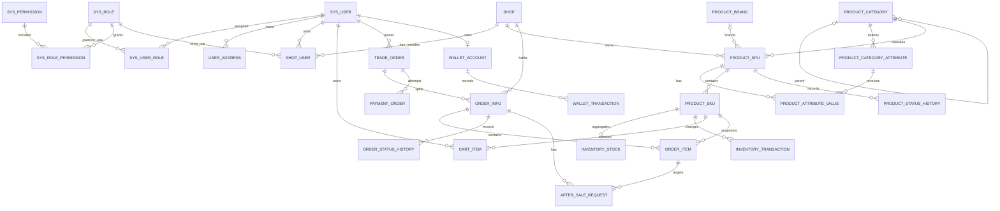
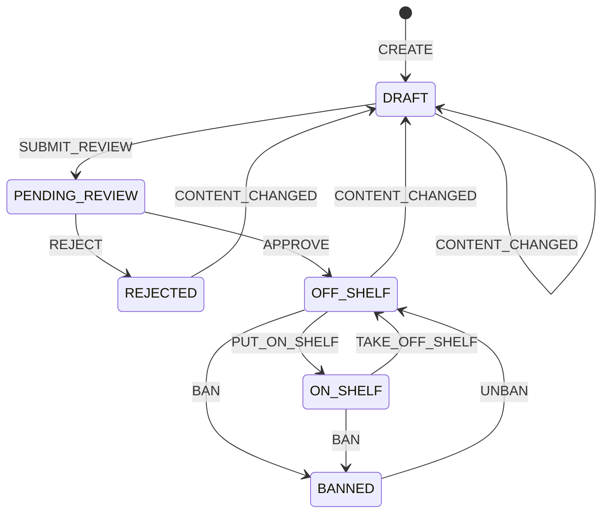
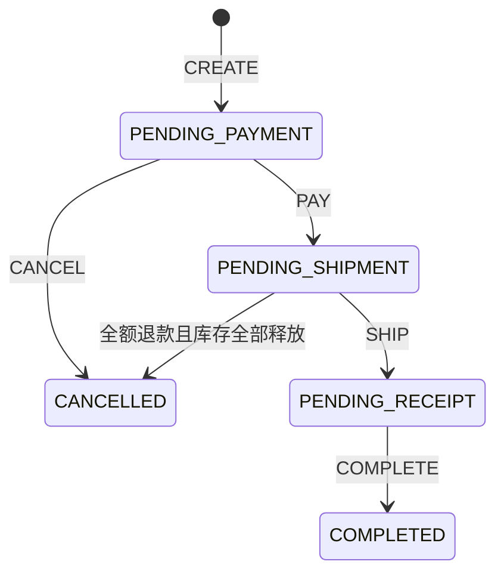

# 时光商城数据库设计规范

本文是时光商城数据库的最终版结构说明，与 [`sql/schema.sql`](../../sql/schema.sql) 基线及后续有序迁移脚本配套使用。本文负责说明数据模型、字段语义、表关系和业务约束；最终物理状态由 `schema.sql` 加按编号顺序执行的迁移脚本共同定义。修改任一表、字段、索引、外键、状态码或金额公式时，必须同步修改本文及对应 SQL 文件。

> 文档关系说明：文件名中的 `phase-1` 是历史名称，本文定义的 26 张表由[基础交易功能分册](../product/phase-1-requirements.md)和[治理与售后功能分册](../product/phase-2-requirements.md)共同使用。产品范围、HTTP 契约和前后端协作规范统一从[文档索引](../README.md)进入；功能分册不会另起一套相互冲突的数据模型。

## 1. 系统范围

系统是一个多商户、类京东的教学商城，数据库包含以下业务能力：

- 用户账号、收货地址、平台 RBAC 和店铺范围 RBAC
- 店铺及店铺成员管理
- 平台类目、品牌和类目属性模板
- 店铺 SPU、SKU、商品审核、上下架和禁售
- SKU 可用库存、锁定库存和库存流水
- 购物车、跨店父交易、按店铺拆分的子订单和订单明细
- 子订单发货、完成、取消及状态历史
- 用户虚拟钱包、模拟充值、跨店统一支付和钱包流水
- 单订单明细售后、仅退款、退货退款和钱包退款

数据库共 26 张业务表。每张表的正式含义和字段结构见第 4 章。

## 2. 通用数据约定

| 项目 | 约定 |
| --- | --- |
| 数据库 | MySQL 8.0.16+，InnoDB，`utf8mb4_0900_ai_ci` |
| 主键 | 独立业务实体使用 `BIGINT UNSIGNED AUTO_INCREMENT`；纯关系表使用复合主键；Java 应用只允许使用 `1..Long.MAX_VALUE`，不得生成或接受超出 signed long 的 ID |
| 金额 | `DECIMAL(18,2)`，单位为元，不使用浮点数 |
| 数量 | 非负聚合量使用 `INT UNSIGNED`；流水变化量使用有符号 `INT` |
| 时间 | `DATETIME(3)`；应用按 Asia/Shanghai 业务时区写入 |
| 状态 | `VARCHAR` 保存稳定英文状态码，Java 代码使用枚举 |
| 布尔值 | `TINYINT(1)`，只允许 `0` 或 `1` |
| JSON | 只保存边界明确的对象或数组；应用写入前必须校验结构和内容 |
| 软删除 | `sys_user`、`user_address`、`product_spu`、`product_sku` 使用 `deleted_at` |
| 历史数据 | 订单、支付、钱包流水、库存流水、状态历史、售后和店铺不得物理删除 |
| 唯一编号 | 用户名、手机号、邮箱、店铺号、SPU 号、SKU 号及各业务单号删除或失效后不复用 |
| 外键删除 | 未声明 `ON DELETE`，使用 MySQL 默认 `RESTRICT`，历史引用会阻止主数据删除 |
| 快照 | 下单时保存地址、店铺名、商品名、规格、图片和成交价格，后续主数据变化不得覆盖订单快照 |
| 并发 | 聚合表和关键业务表使用 `version`；扣库存、扣余额和状态迁移使用条件更新或行锁 |
| 幂等 | 业务单号、流水业务键和成功支付保护键使用唯一约束 |

`CHECK` 约束从 MySQL 8.0.16 开始真正执行。本结构不适用于旧版本 MySQL 或 MariaDB。

除各表另有说明外，`created_at` 默认使用 `CURRENT_TIMESTAMP(3)`，`updated_at` 默认使用 `CURRENT_TIMESTAMP(3)` 并在记录更新时自动刷新。所有 `version` 字段初始值为 `0`，成功完成一次受版本控制的更新后递增。

## 3. 核心关系



`shop` 是店铺数据的租户边界。SPU、SKU、库存和子订单都能够沿外键关系确定所属店铺。`trade_order` 是买家一次提交和一次支付的父交易，`order_info` 是按店铺拆分后的履约子订单。

SKU 与库存、用户与钱包在物理关系上是 `0..1`，因为主记录创建和配套记录初始化可能存在短暂时间差。应用必须在创建 SKU 时初始化 `inventory_stock`，在注册用户时初始化 `wallet_account`。

## 4. 表结构与字段含义

### 4.1 用户与权限

#### 4.1.1 `sys_user`

统一登录账号表。买家、平台人员和店铺人员都使用该表，不为不同身份重复创建账号。

| 字段 | 类型与空值 | 含义 |
| --- | --- | --- |
| `id` | `BIGINT UNSIGNED`，主键，自增 | 用户 ID |
| `username` | `VARCHAR(64)`，非空，唯一 | 登录用户名，停用或软删除后也不复用 |
| `password_hash` | `VARCHAR(255)`，非空 | BCrypt 或 Argon2 密码摘要，不保存明文密码 |
| `nickname` | `VARCHAR(64)`，非空 | 展示昵称 |
| `phone` | `VARCHAR(32)`，可空，唯一 | 登录或联系手机号 |
| `email` | `VARCHAR(128)`，可空，唯一 | 登录或联系邮箱 |
| `avatar_url` | `VARCHAR(1024)`，可空 | 头像地址 |
| `status` | `VARCHAR(20)`，非空，默认 `ACTIVE` | `ACTIVE` 正常、`DISABLED` 管理员禁用、`LOCKED` 登录风控锁定 |
| `last_login_at` | `DATETIME(3)`，可空 | 最近一次成功登录时间 |
| `created_at` | `DATETIME(3)`，非空 | 创建时间 |
| `updated_at` | `DATETIME(3)`，非空 | 最后更新时间，记录更新时由数据库自动刷新 |
| `deleted_at` | `DATETIME(3)`，可空 | 软删除时间；非空表示账号已删除 |

鉴权必须同时检查 `status = ACTIVE` 且 `deleted_at IS NULL`。

#### 4.1.2 `sys_role`

RBAC 角色定义表，同时保存平台角色和店铺角色。

| 字段 | 类型与空值 | 含义 |
| --- | --- | --- |
| `id` | `BIGINT UNSIGNED`，主键，自增 | 角色 ID |
| `role_code` | `VARCHAR(64)`，非空，唯一 | 稳定角色代码，供程序鉴权和种子数据引用 |
| `role_name` | `VARCHAR(64)`，非空 | 角色显示名称 |
| `scope_type` | `VARCHAR(20)`，非空 | `PLATFORM` 平台全局作用域，`SHOP` 店铺作用域 |
| `description` | `VARCHAR(255)`，可空 | 角色职责说明 |
| `status` | `VARCHAR(20)`，非空，默认 `ACTIVE` | `ACTIVE` 可用、`DISABLED` 停用 |
| `created_at` | `DATETIME(3)`，非空 | 创建时间 |
| `updated_at` | `DATETIME(3)`，非空 | 最后更新时间，记录更新时由数据库自动刷新 |

`UNIQUE(id, scope_type)` 为复合作用域外键提供目标键，保证角色分配不会混用平台角色和店铺角色。

#### 4.1.3 `sys_permission`

API 权限定义表。权限代码是服务端授权判断的稳定标识。

| 字段 | 类型与空值 | 含义 |
| --- | --- | --- |
| `id` | `BIGINT UNSIGNED`，主键，自增 | 权限 ID |
| `permission_code` | `VARCHAR(128)`，非空，唯一 | 权限代码，例如 `shop:product:manage` |
| `permission_name` | `VARCHAR(64)`，非空 | 权限显示名称 |
| `scope_type` | `VARCHAR(20)`，非空 | `PLATFORM` 或 `SHOP` |
| `resource` | `VARCHAR(255)`，可空 | 对应路由或 API 模式 |
| `http_method` | `VARCHAR(10)`，可空 | 限定 HTTP 方法；空值表示不按方法细分 |
| `status` | `VARCHAR(20)`，非空，默认 `ACTIVE` | `ACTIVE` 可参与鉴权、`DISABLED` 停用 |
| `created_at` | `DATETIME(3)`，非空 | 创建时间 |
| `updated_at` | `DATETIME(3)`，非空 | 最后更新时间，记录更新时由数据库自动刷新 |

`UNIQUE(id, scope_type)` 用于保证角色和权限的作用域一致。

#### 4.1.4 `sys_user_role`

用户与平台角色的分配关系表。

| 字段 | 类型与空值 | 含义 |
| --- | --- | --- |
| `user_id` | `BIGINT UNSIGNED`，主键组成，外键 | 关联 `sys_user.id` |
| `role_id` | `BIGINT UNSIGNED`，主键组成 | 角色 ID |
| `role_scope` | `VARCHAR(20)`，非空，默认且固定为 `PLATFORM` | 与 `role_id` 共同外键到 `sys_role(id, scope_type)` |
| `created_at` | `DATETIME(3)`，非空 | 分配时间 |

复合主键 `(user_id, role_id)` 防止重复分配。该表只分配平台角色；用户在店铺中的角色由 `shop_user` 保存。

#### 4.1.5 `sys_role_permission`

角色与权限的授权关系表。

| 字段 | 类型与空值 | 含义 |
| --- | --- | --- |
| `role_id` | `BIGINT UNSIGNED`，主键组成 | 角色 ID |
| `permission_id` | `BIGINT UNSIGNED`，主键组成 | 权限 ID |
| `scope_type` | `VARCHAR(20)`，非空 | 同时参与角色外键和权限外键，保证二者作用域相同 |
| `created_at` | `DATETIME(3)`，非空 | 授权时间 |

复合主键 `(role_id, permission_id)` 防止重复授权。鉴权时还必须检查角色和权限的 `status` 均为 `ACTIVE`。

#### 4.1.6 `user_address`

用户维护的收货地址表。订单不会直接依赖此表中的可变地址，而是在下单时复制地址快照。

| 字段 | 类型与空值 | 含义 |
| --- | --- | --- |
| `id` | `BIGINT UNSIGNED`，主键，自增 | 地址 ID |
| `user_id` | `BIGINT UNSIGNED`，非空，外键 | 地址所属用户 |
| `recipient_name` | `VARCHAR(64)`，非空 | 收件人姓名 |
| `recipient_phone` | `VARCHAR(32)`，非空 | 收件人手机号 |
| `province_name` | `VARCHAR(64)`，非空 | 省级行政区名称 |
| `city_name` | `VARCHAR(64)`，非空 | 市级行政区名称 |
| `district_name` | `VARCHAR(64)`，非空 | 区县名称 |
| `detail_address` | `VARCHAR(255)`，非空 | 详细地址 |
| `is_default` | `TINYINT(1)`，非空，默认 `0` | `1` 默认地址，`0` 普通地址 |
| `created_at` | `DATETIME(3)`，非空 | 创建时间 |
| `updated_at` | `DATETIME(3)`，非空 | 最后更新时间，记录更新时由数据库自动刷新 |
| `deleted_at` | `DATETIME(3)`，可空 | 软删除时间 |
| `default_user_id` | `BIGINT UNSIGNED`，生成列 | 未删除且为默认地址时等于 `user_id`，否则为 `NULL` |

唯一索引 `UNIQUE(default_user_id)` 利用 MySQL 允许多个 `NULL` 的特性，保证每名用户最多一个未删除的默认地址。切换默认地址时必须在一个事务中先清除旧默认，再设置新默认。

### 4.2 店铺

#### 4.2.1 `shop`

店铺主表，也是商家数据的租户边界。

| 字段 | 类型与空值 | 含义 |
| --- | --- | --- |
| `id` | `BIGINT UNSIGNED`，主键，自增 | 店铺 ID |
| `shop_no` | `VARCHAR(64)`，非空，唯一 | 店铺业务编号 |
| `shop_name` | `VARCHAR(128)`，非空 | 当前店铺名称 |
| `logo_url` | `VARCHAR(1024)`，可空 | 店铺 Logo 地址 |
| `description` | `VARCHAR(500)`，可空 | 店铺简介 |
| `contact_name` | `VARCHAR(64)`，可空 | 店铺联系人 |
| `contact_phone` | `VARCHAR(32)`，可空 | 店铺联系电话 |
| `status` | `VARCHAR(20)`，非空，默认 `PENDING` | `PENDING` 待审核、`ACTIVE` 正常、`SUSPENDED` 暂停、`CLOSED` 永久关闭 |
| `created_at` | `DATETIME(3)`，非空 | 创建时间 |
| `updated_at` | `DATETIME(3)`，非空 | 最后更新时间，记录更新时由数据库自动刷新 |

只有 `ACTIVE` 店铺的在售商品允许购买。店铺暂停或关闭时保留商品、订单和历史数据。

#### 4.2.2 `shop_user`

用户在某个店铺中的成员身份和当前店铺角色。

| 字段 | 类型与空值 | 含义 |
| --- | --- | --- |
| `shop_id` | `BIGINT UNSIGNED`，主键组成，外键 | 所属店铺 |
| `user_id` | `BIGINT UNSIGNED`，主键组成，外键 | 成员用户 |
| `role_id` | `BIGINT UNSIGNED`，非空 | 当前店铺角色 ID |
| `role_scope` | `VARCHAR(20)`，非空，默认且固定为 `SHOP` | 与 `role_id` 共同外键到店铺作用域角色 |
| `status` | `VARCHAR(20)`，非空，默认 `ACTIVE` | `ACTIVE` 有效、`DISABLED` 停用 |
| `created_at` | `DATETIME(3)`，非空 | 加入店铺时间 |
| `updated_at` | `DATETIME(3)`，非空 | 最后更新时间，记录更新时由数据库自动刷新 |

复合主键 `(shop_id, user_id)` 规定一名用户在同一店铺只有一条成员记录和一个当前角色。店铺接口必须同时校验权限代码、目标 `shop_id`、成员状态、角色状态和用户状态。

### 4.3 商品治理

#### 4.3.1 `product_category`

平台维护的商品类目树。

| 字段 | 类型与空值 | 含义 |
| --- | --- | --- |
| `id` | `BIGINT UNSIGNED`，主键，自增 | 类目 ID |
| `parent_id` | `BIGINT UNSIGNED`，可空，自引用外键 | 父类目；根类目为 `NULL` |
| `category_name` | `VARCHAR(64)`，非空 | 类目名称 |
| `category_code` | `VARCHAR(64)`，非空，唯一 | 稳定类目代码 |
| `sort_order` | `INT`，非空，默认 `0` | 同级显示顺序，值越小越靠前 |
| `status` | `VARCHAR(20)`，非空，默认 `ENABLED` | `ENABLED` 可用、`DISABLED` 停用 |
| `created_at` | `DATETIME(3)`，非空 | 创建时间 |
| `updated_at` | `DATETIME(3)`，非空 | 最后更新时间，记录更新时由数据库自动刷新 |

应用必须阻止类目树形成环，并保证 SPU 只能选择启用的叶子类目。

#### 4.3.2 `product_category_attribute`

平台为叶子类目定义的 SPU 描述属性模板。

| 字段 | 类型与空值 | 含义 |
| --- | --- | --- |
| `id` | `BIGINT UNSIGNED`，主键，自增 | 属性模板 ID |
| `category_id` | `BIGINT UNSIGNED`，非空，外键 | 所属叶子类目 |
| `attribute_name` | `VARCHAR(64)`，非空 | 属性名称；同类目内唯一 |
| `value_type` | `VARCHAR(20)`，非空 | `TEXT`、`NUMBER`、`BOOLEAN`、`OPTION` |
| `unit` | `VARCHAR(32)`，可空 | 数值属性单位，例如 `mAh` |
| `is_required` | `TINYINT(1)`，非空，默认 `0` | 是否为该类目 SPU 的必填属性 |
| `is_filterable` | `TINYINT(1)`，非空，默认 `0` | 是否可作为商品列表的结构化筛选条件 |
| `options_json` | `JSON`，可空 | `OPTION` 类型的候选字符串数组；其他类型必须为 `NULL` |
| `sort_order` | `INT`，非空，默认 `0` | 属性展示顺序 |
| `status` | `VARCHAR(20)`，非空，默认 `ENABLED` | `ENABLED` 可用、`DISABLED` 停用 |
| `created_at` | `DATETIME(3)`，非空 | 创建时间 |
| `updated_at` | `DATETIME(3)`，非空 | 最后更新时间，记录更新时由数据库自动刷新 |

唯一键 `(category_id, attribute_name)` 防止同类目重名。`UNIQUE(id, category_id)` 用于保证属性值引用的模板与 SPU 类目一致。应用必须校验候选项为唯一、非空字符串，并按 `value_type` 校验实际属性值。

#### 4.3.3 `product_brand`

平台维护的品牌主数据。

| 字段 | 类型与空值 | 含义 |
| --- | --- | --- |
| `id` | `BIGINT UNSIGNED`，主键，自增 | 品牌 ID |
| `brand_name` | `VARCHAR(128)`，非空 | 品牌名称 |
| `brand_code` | `VARCHAR(64)`，非空，唯一 | 稳定品牌代码 |
| `logo_url` | `VARCHAR(1024)`，可空 | 品牌 Logo 地址 |
| `status` | `VARCHAR(20)`，非空，默认 `ENABLED` | `ENABLED` 可使用、`DISABLED` 停用 |
| `created_at` | `DATETIME(3)`，非空 | 创建时间 |
| `updated_at` | `DATETIME(3)`，非空 | 最后更新时间，记录更新时由数据库自动刷新 |

品牌停用后不得用于新商品，但历史 SPU 引用继续保留。

#### 4.3.4 `product_spu`

店铺拥有的标准商品单元，保存商品公共内容和唯一商品治理状态。

| 字段 | 类型与空值 | 含义 |
| --- | --- | --- |
| `id` | `BIGINT UNSIGNED`，主键，自增 | SPU ID |
| `shop_id` | `BIGINT UNSIGNED`，非空，外键 | 商品所属店铺 |
| `category_id` | `BIGINT UNSIGNED`，非空，外键 | 商品所属叶子类目 |
| `brand_id` | `BIGINT UNSIGNED`，可空，外键 | 品牌；无品牌商品可以为 `NULL` |
| `spu_no` | `VARCHAR(64)`，非空，唯一 | SPU 业务编号 |
| `product_name` | `VARCHAR(255)`，非空 | 商品名称 |
| `subtitle` | `VARCHAR(500)`，可空 | 商品副标题 |
| `cover_url` | `VARCHAR(1024)`，可空 | 商品封面图 |
| `gallery_json` | `JSON`，可空 | 按展示顺序排列的轮播图片 URL 数组 |
| `detail_html` | `LONGTEXT`，可空 | 清洗后的商品详情 HTML，可包含详情图片 |
| `packing_list` | `TEXT`，可空 | 包装清单 |
| `service_note` | `TEXT`，可空 | 售后或服务说明 |
| `status` | `VARCHAR(30)`，非空，默认 `DRAFT` | `DRAFT`、`PENDING_REVIEW`、`REJECTED`、`OFF_SHELF`、`ON_SHELF`、`BANNED` |
| `content_version` | `INT UNSIGNED`，非空，默认 `0` | 受审核内容版本；关键内容变化时递增 |
| `created_by` | `BIGINT UNSIGNED`，非空，外键 | 创建人，关联 `sys_user.id` |
| `updated_by` | `BIGINT UNSIGNED`，非空，外键 | 最后修改人，关联 `sys_user.id` |
| `created_at` | `DATETIME(3)`，非空 | 创建时间 |
| `updated_at` | `DATETIME(3)`，非空 | 最后更新时间，记录更新时由数据库自动刷新 |
| `deleted_at` | `DATETIME(3)`，可空 | 软删除时间 |

`UNIQUE(id, shop_id)` 和 `UNIQUE(id, category_id)` 分别用于约束 SKU 店铺归属和属性值类目归属。`gallery_json` 只能是 JSON 数组。商品状态更新必须和 `product_status_history` 写入处于同一事务。

#### 4.3.5 `product_attribute_value`

SPU 对类目描述属性模板填写的值。

| 字段 | 类型与空值 | 含义 |
| --- | --- | --- |
| `spu_id` | `BIGINT UNSIGNED`，主键组成 | SPU ID |
| `category_id` | `BIGINT UNSIGNED`，非空 | 同时参与 SPU 和属性模板的复合外键，保证二者属于同一类目 |
| `attribute_id` | `BIGINT UNSIGNED`，主键组成 | 类目属性模板 ID |
| `attribute_value` | `VARCHAR(1000)`，非空 | 规范化后的属性值文本 |
| `created_at` | `DATETIME(3)`，非空 | 创建时间 |
| `updated_at` | `DATETIME(3)`，非空 | 最后更新时间，记录更新时由数据库自动刷新 |

复合主键 `(spu_id, attribute_id)` 保证一个 SPU 对一个属性模板最多填写一次。应用负责校验必填属性、数值格式、布尔格式和候选值范围。

#### 4.3.6 `product_sku`

SPU 下可被购买和计价的具体销售规格。

| 字段 | 类型与空值 | 含义 |
| --- | --- | --- |
| `id` | `BIGINT UNSIGNED`，主键，自增 | SKU ID |
| `spu_id` | `BIGINT UNSIGNED`，非空 | 所属 SPU |
| `shop_id` | `BIGINT UNSIGNED`，非空 | 所属店铺；与 `spu_id` 组成复合外键，保证和 SPU 同店 |
| `sku_no` | `VARCHAR(64)`，非空，唯一 | SKU 业务编号 |
| `sku_name` | `VARCHAR(255)`，非空 | SKU 展示名称 |
| `spec_json` | `JSON`，非空 | 销售规格对象，例如 `{"color":"黑色","storage":"256GB"}` |
| `spec_key` | `CHAR(64)`，ASCII 二进制排序，非空 | 规范化 `spec_json` 的小写 SHA-256 十六进制摘要 |
| `sale_price` | `DECIMAL(18,2)`，非空 | 当前销售价格，必须大于 0 |
| `market_price` | `DECIMAL(18,2)`，可空 | 市场参考价；非空时不得低于销售价 |
| `barcode` | `VARCHAR(64)`，可空 | 商品条码 |
| `image_url` | `VARCHAR(1024)`，可空 | SKU 专属图片 |
| `status` | `VARCHAR(20)`，非空，默认 `ENABLED` | `ENABLED` 启用、`DISABLED` 停用 |
| `version` | `INT UNSIGNED`，非空，默认 `0` | SKU 并发版本号 |
| `created_at` | `DATETIME(3)`，非空 | 创建时间 |
| `updated_at` | `DATETIME(3)`，非空 | 最后更新时间，记录更新时由数据库自动刷新 |
| `deleted_at` | `DATETIME(3)`，可空 | 软删除时间 |

`spec_json` 必须是 JSON 对象。应用对键和值去除首尾空白并执行 Unicode NFC 规范化，按键升序生成无多余空白的规范 JSON，再计算 `spec_key`。唯一键 `(spu_id, spec_key)` 防止同一 SPU 出现重复规格组合。`UNIQUE(id, spu_id, shop_id)` 用于保证订单明细引用的 SKU、SPU 和店铺一致。

#### 4.3.7 `product_status_history`

商品创建、审核、上下架、禁售和内容变化的不可变审计历史。

| 字段 | 类型与空值 | 含义 |
| --- | --- | --- |
| `id` | `BIGINT UNSIGNED`，主键，自增 | 历史记录 ID |
| `spu_id` | `BIGINT UNSIGNED`，非空，外键 | 对应 SPU |
| `from_status` | `VARCHAR(30)`，可空 | 变化前状态；创建操作为 `NULL` |
| `to_status` | `VARCHAR(30)`，非空 | 变化后状态：`DRAFT`、`PENDING_REVIEW`、`REJECTED`、`OFF_SHELF`、`ON_SHELF`、`BANNED` |
| `operation_type` | `VARCHAR(30)`，非空 | `CREATE`、`SUBMIT_REVIEW`、`APPROVE`、`REJECT`、`PUT_ON_SHELF`、`TAKE_OFF_SHELF`、`BAN`、`UNBAN`、`CONTENT_CHANGED` |
| `content_version` | `INT UNSIGNED`，非空 | 本次操作对应的 SPU 内容版本 |
| `operator_type` | `VARCHAR(20)`，非空 | `SHOP`、`PLATFORM`、`SYSTEM` |
| `operator_id` | `BIGINT UNSIGNED`，可空，外键 | 人工操作关联用户；系统操作必须为 `NULL` |
| `reason` | `VARCHAR(500)`，可空 | 原因；`REJECT` 和 `BAN` 必填 |
| `created_at` | `DATETIME(3)`，非空 | 操作时间 |

数据库 `CHECK` 已限制合法状态迁移和操作者类型：店铺可创建、提交审核、上架和修改内容；平台可审核、禁售和解禁；下架可由店铺或平台执行。

### 4.4 库存与购物车

#### 4.4.1 `inventory_stock`

SKU 当前库存聚合表，每个 SKU 恰好维护一条库存记录。

| 字段 | 类型与空值 | 含义 |
| --- | --- | --- |
| `id` | `BIGINT UNSIGNED`，主键，自增 | 库存记录 ID |
| `sku_id` | `BIGINT UNSIGNED`，非空，外键，唯一 | 对应 SKU |
| `available_quantity` | `INT UNSIGNED`，非空，默认 `0` | 可继续销售的数量 |
| `locked_quantity` | `INT UNSIGNED`，非空，默认 `0` | 已被订单预占但尚未释放或出库的数量 |
| `version` | `INT UNSIGNED`，非空，默认 `0` | 乐观锁版本号 |
| `created_at` | `DATETIME(3)`，非空 | 创建时间 |
| `updated_at` | `DATETIME(3)`，非空 | 最后更新时间，记录更新时由数据库自动刷新 |

当前持有库存等于 `available_quantity + locked_quantity`。所有变化必须和对应的 `inventory_transaction` 在同一事务中写入。

#### 4.4.2 `inventory_transaction`

不可修改的库存流水，用于追踪每次库存变化和变化后的聚合值。

| 字段 | 类型与空值 | 含义 |
| --- | --- | --- |
| `id` | `BIGINT UNSIGNED`，主键，自增 | 流水 ID |
| `transaction_no` | `VARCHAR(64)`，非空，唯一 | 库存流水号 |
| `sku_id` | `BIGINT UNSIGNED`，非空，外键 | 发生变化的 SKU |
| `transaction_type` | `VARCHAR(30)`，非空 | `INBOUND` 入库、`LOCK` 预占、`RELEASE` 释放、`DEDUCT` 出库、`RETURN` 退货入库、`ADJUST` 人工调整 |
| `available_change` | `INT`，非空，默认 `0` | 可用库存变化量，可正可负 |
| `locked_change` | `INT`，非空，默认 `0` | 锁定库存变化量，可正可负 |
| `available_after` | `INT UNSIGNED`，非空 | 本次变化后的可用库存 |
| `locked_after` | `INT UNSIGNED`，非空 | 本次变化后的锁定库存 |
| `business_type` | `VARCHAR(30)`，非空 | 业务来源类型，由应用字典统一管理 |
| `business_no` | `VARCHAR(64)`，非空 | 来源业务编号 |
| `operator_id` | `BIGINT UNSIGNED`，可空，外键 | 人工操作用户；系统操作可为空 |
| `remark` | `VARCHAR(500)`，可空 | 备注或调整原因 |
| `created_at` | `DATETIME(3)`，非空 | 发生时间 |

唯一键 `(sku_id, transaction_type, business_type, business_no)` 保证同一业务对同一 SKU 的同类变化幂等。变化前数量可用“变化后数量减变化量”推导。`LOCK` 必须表现为可用减少、锁定等量增加；`RELEASE` 相反；`DEDUCT` 只减少锁定库存。

#### 4.4.3 `cart_item`

用户下单前暂存的 SKU 和购买数量。

| 字段 | 类型与空值 | 含义 |
| --- | --- | --- |
| `id` | `BIGINT UNSIGNED`，主键，自增 | 购物车项 ID |
| `user_id` | `BIGINT UNSIGNED`，非空，外键 | 所属用户 |
| `sku_id` | `BIGINT UNSIGNED`，非空，外键 | 选择的 SKU |
| `quantity` | `INT UNSIGNED`，非空 | 购买数量，范围 `1..999` |
| `selected` | `TINYINT(1)`，非空，默认 `1` | 是否被本次下单勾选 |
| `created_at` | `DATETIME(3)`，非空 | 加入购物车时间 |
| `updated_at` | `DATETIME(3)`，非空 | 最后更新时间，记录更新时由数据库自动刷新 |

唯一键 `(user_id, sku_id)` 保证同一用户的同一 SKU 只有一行，重复加入时更新数量。购物车不锁库存、不保存价格，下单时必须重新校验商品状态、实时价格和库存。

### 4.5 交易与订单

#### 4.5.1 `trade_order`

买家一次跨店提交形成的父交易，统一保存收货地址、总应付金额和支付状态。

| 字段 | 类型与空值 | 含义 |
| --- | --- | --- |
| `id` | `BIGINT UNSIGNED`，主键，自增 | 父交易 ID |
| `trade_no` | `VARCHAR(64)`，非空，唯一 | 父交易业务编号 |
| `user_id` | `BIGINT UNSIGNED`，非空，外键 | 买家用户 ID |
| `trade_status` | `VARCHAR(30)`，非空，默认 `PENDING_PAYMENT` | `PENDING_PAYMENT`、`PAID`、`CANCELLED` |
| `payable_amount` | `DECIMAL(18,2)`，非空 | 所有子订单应付金额之和，必须大于 0 |
| `recipient_name` | `VARCHAR(64)`，非空 | 下单时收件人姓名快照 |
| `recipient_phone` | `VARCHAR(32)`，非空 | 下单时收件人手机号快照 |
| `province_name` | `VARCHAR(64)`，非空 | 下单时省级行政区名称快照 |
| `city_name` | `VARCHAR(64)`，非空 | 下单时市级行政区名称快照 |
| `district_name` | `VARCHAR(64)`，非空 | 下单时区县名称快照 |
| `detail_address` | `VARCHAR(255)`，非空 | 下单时详细地址快照 |
| `pay_expire_at` | `DATETIME(3)`，非空 | 支付截止时间 |
| `paid_at` | `DATETIME(3)`，可空 | 成功支付时间，仅 `PAID` 非空 |
| `cancelled_at` | `DATETIME(3)`，可空 | 取消时间，仅 `CANCELLED` 非空 |
| `version` | `INT UNSIGNED`，非空，默认 `0` | 并发版本号 |
| `created_at` | `DATETIME(3)`，非空 | 创建时间 |
| `updated_at` | `DATETIME(3)`，非空 | 最后更新时间，记录更新时由数据库自动刷新 |

`UNIQUE(id, user_id)` 用于保证子订单和父交易属于同一用户。付款前取消作用于整张父交易；支付后父交易保持 `PAID`，各店铺子订单独立发货、完成和退款。

#### 4.5.2 `order_info`

父交易按店铺拆分后的子订单，是店铺履约和买家售后的订单边界。

| 字段 | 类型与空值 | 含义 |
| --- | --- | --- |
| `id` | `BIGINT UNSIGNED`，主键，自增 | 子订单 ID |
| `order_no` | `VARCHAR(64)`，非空，唯一 | 子订单业务编号 |
| `trade_id` | `BIGINT UNSIGNED`，非空 | 所属父交易 |
| `user_id` | `BIGINT UNSIGNED`，非空 | 买家 ID；和 `trade_id` 组成复合外键 |
| `shop_id` | `BIGINT UNSIGNED`，非空，外键 | 履约店铺 |
| `shop_name` | `VARCHAR(128)`，非空 | 下单时店铺名称快照 |
| `order_status` | `VARCHAR(30)`，非空，默认 `PENDING_PAYMENT` | `PENDING_PAYMENT`、`PENDING_SHIPMENT`、`PENDING_RECEIPT`、`COMPLETED`、`CANCELLED` |
| `payment_status` | `VARCHAR(30)`，非空，默认 `UNPAID` | `UNPAID`、`PAID`、`PARTIALLY_REFUNDED`、`REFUNDED` |
| `item_amount` | `DECIMAL(18,2)`，非空 | 本子订单所有明细 `original_amount` 之和 |
| `freight_amount` | `DECIMAL(18,2)`，非空，默认 `0.00` | 本子订单运费 |
| `payable_amount` | `DECIMAL(18,2)`，非空 | `item_amount + freight_amount`，必须大于 0 |
| `refund_amount` | `DECIMAL(18,2)`，非空，默认 `0.00` | 已成功退款金额累计，不得超过应付金额 |
| `buyer_remark` | `VARCHAR(500)`，可空 | 买家下单备注 |
| `cancel_reason` | `VARCHAR(255)`，可空 | 取消原因 |
| `carrier_code` | `VARCHAR(64)`，可空 | 发货快递公司代码 |
| `carrier_name` | `VARCHAR(128)`，可空 | 发货快递公司名称 |
| `tracking_no` | `VARCHAR(128)`，可空 | 运单号 |
| `shipped_at` | `DATETIME(3)`，可空 | 发货时间 |
| `completed_at` | `DATETIME(3)`，可空 | 完成时间，仅 `COMPLETED` 非空 |
| `cancelled_at` | `DATETIME(3)`，可空 | 取消时间，仅 `CANCELLED` 非空 |
| `version` | `INT UNSIGNED`，非空，默认 `0` | 并发版本号 |
| `created_at` | `DATETIME(3)`，非空 | 创建时间 |
| `updated_at` | `DATETIME(3)`，非空 | 最后更新时间，记录更新时由数据库自动刷新 |

唯一键 `(trade_id, shop_id)` 保证一次跨店下单中每个店铺只有一张子订单。`UNIQUE(id, user_id)` 和 `UNIQUE(id, shop_id)` 为售后归属及订单明细店铺归属提供复合外键目标。发货后的订单必须同时具有快递公司、运单号和 `shipped_at`；发货前这些字段必须全部为空。

#### 4.5.3 `order_item`

子订单明细，保存成交时商品快照、金额、累计退款和库存预占结果。

| 字段 | 类型与空值 | 含义 |
| --- | --- | --- |
| `id` | `BIGINT UNSIGNED`，主键，自增 | 订单明细 ID |
| `order_id` | `BIGINT UNSIGNED`，非空 | 所属子订单 |
| `shop_id` | `BIGINT UNSIGNED`，非空 | 店铺 ID；和 `order_id`、SKU 关系共同保证归属一致 |
| `spu_id` | `BIGINT UNSIGNED`，非空 | 成交商品的 SPU ID |
| `sku_id` | `BIGINT UNSIGNED`，非空 | 成交商品的 SKU ID |
| `spu_no` | `VARCHAR(64)`，非空 | 成交时 SPU 编号快照 |
| `sku_no` | `VARCHAR(64)`，非空 | 成交时 SKU 编号快照 |
| `product_name` | `VARCHAR(255)`，非空 | 成交时商品名称快照 |
| `sku_name` | `VARCHAR(255)`，非空 | 成交时 SKU 名称快照 |
| `spec_json` | `JSON`，非空 | 成交时销售规格对象快照 |
| `image_url` | `VARCHAR(1024)`，可空 | 成交时商品图片快照 |
| `unit_price` | `DECIMAL(18,2)`，非空 | 成交单价，必须大于 0 |
| `quantity` | `INT UNSIGNED`，非空 | 购买数量，必须大于 0 |
| `original_amount` | `DECIMAL(18,2)`，非空 | `unit_price * quantity` |
| `freight_amount` | `DECIMAL(18,2)`，非空，默认 `0.00` | 分摊到该明细的子订单运费 |
| `payable_amount` | `DECIMAL(18,2)`，非空 | `original_amount + freight_amount` |
| `refunded_quantity` | `INT UNSIGNED`，非空，默认 `0` | 已成功退款数量累计，不得超过购买数量 |
| `refunded_amount` | `DECIMAL(18,2)`，非空，默认 `0.00` | 已成功退款金额累计，不得超过明细应付金额 |
| `reservation_status` | `VARCHAR(20)`，非空，默认 `LOCKED` | `LOCKED` 已预占、`RELEASED` 已释放、`DEDUCTED` 已出库 |
| `created_at` | `DATETIME(3)`，非空 | 创建时间 |

`(order_id, shop_id)` 外键保证明细属于对应店铺子订单；`(sku_id, spu_id, shop_id)` 外键保证 SKU、SPU 和店铺一致。商品快照和成交金额创建后不得随商品主数据变化。

#### 4.5.4 `order_status_history`

子订单主状态的不可变审计历史。

| 字段 | 类型与空值 | 含义 |
| --- | --- | --- |
| `id` | `BIGINT UNSIGNED`，主键，自增 | 历史记录 ID |
| `order_id` | `BIGINT UNSIGNED`，非空，外键 | 对应子订单 |
| `from_status` | `VARCHAR(30)`，可空 | 变化前状态；创建操作为 `NULL` |
| `to_status` | `VARCHAR(30)`，非空 | 变化后状态：`PENDING_PAYMENT`、`PENDING_SHIPMENT`、`PENDING_RECEIPT`、`COMPLETED`、`CANCELLED` |
| `operation_type` | `VARCHAR(30)`，非空 | `CREATE`、`PAY`、`CANCEL`、`SHIP`、`COMPLETE` |
| `operator_type` | `VARCHAR(20)`，非空 | `USER`、`SHOP`、`PLATFORM`、`SYSTEM` |
| `operator_id` | `BIGINT UNSIGNED`，可空，外键 | 人工操作用户；系统操作必须为 `NULL` |
| `remark` | `VARCHAR(500)`，可空 | 操作备注 |
| `created_at` | `DATETIME(3)`，非空 | 状态变化时间 |

数据库限制合法状态迁移。子订单当前状态更新和对应历史写入必须在同一事务中完成。

### 4.6 钱包与支付

#### 4.6.1 `wallet_account`

用户虚拟钱包的当前聚合余额，每名用户最多一个钱包。

| 字段 | 类型与空值 | 含义 |
| --- | --- | --- |
| `id` | `BIGINT UNSIGNED`，主键，自增 | 钱包 ID |
| `user_id` | `BIGINT UNSIGNED`，非空，外键，唯一 | 钱包所属用户 |
| `balance` | `DECIMAL(18,2)`，非空，默认 `0.00` | 当前可用余额，不得小于 0 |
| `status` | `VARCHAR(20)`，非空，默认 `ACTIVE` | `ACTIVE` 正常、`FROZEN` 整个账户冻结、`CLOSED` 永久关闭 |
| `version` | `INT UNSIGNED`，非空，默认 `0` | 乐观锁版本号 |
| `created_at` | `DATETIME(3)`，非空 | 创建时间 |
| `updated_at` | `DATETIME(3)`，非空 | 最后更新时间，记录更新时由数据库自动刷新 |

余额变化必须和 `wallet_transaction` 写入处于同一事务。`FROZEN` 表示账户整体禁止资金操作，不表示部分金额被冻结。

#### 4.6.2 `payment_order`

父交易的一次钱包支付尝试。一张父交易可以有多次尝试，但最多一次成功。

| 字段 | 类型与空值 | 含义 |
| --- | --- | --- |
| `id` | `BIGINT UNSIGNED`，主键，自增 | 支付单 ID |
| `payment_no` | `VARCHAR(64)`，非空，唯一 | 支付业务编号 |
| `trade_id` | `BIGINT UNSIGNED`，非空，外键 | 被支付的父交易 |
| `amount` | `DECIMAL(18,2)`，非空 | 本次支付金额，必须大于 0 且等于父交易应付金额 |
| `status` | `VARCHAR(20)`，非空，默认 `PENDING` | `PENDING`、`SUCCESS`、`FAILED`、`CANCELLED` |
| `success_guard` | `BIGINT UNSIGNED`，生成列 | 成功时等于 `trade_id`，其他状态为 `NULL` |
| `failure_reason` | `VARCHAR(500)`，可空 | 支付失败原因 |
| `paid_at` | `DATETIME(3)`，可空 | 成功支付时间，仅 `SUCCESS` 非空 |
| `expires_at` | `DATETIME(3)`，非空 | 本次支付尝试过期时间 |
| `created_at` | `DATETIME(3)`，非空 | 创建时间 |
| `updated_at` | `DATETIME(3)`，非空 | 最后更新时间，记录更新时由数据库自动刷新 |

唯一索引 `UNIQUE(success_guard)` 保证同一父交易最多一笔成功支付；仍需通过事务锁避免两个支付请求同时执行扣款。

#### 4.6.3 `wallet_transaction`

不可修改的钱包资金流水，包括模拟充值、消费、退款和人工调整。

| 字段 | 类型与空值 | 含义 |
| --- | --- | --- |
| `id` | `BIGINT UNSIGNED`，主键，自增 | 流水 ID |
| `transaction_no` | `VARCHAR(64)`，非空，唯一 | 钱包流水号 |
| `wallet_id` | `BIGINT UNSIGNED`，非空，外键 | 对应钱包 |
| `transaction_type` | `VARCHAR(20)`，非空 | `RECHARGE`、`CONSUME`、`REFUND`、`ADJUST` |
| `direction` | `VARCHAR(10)`，非空 | `CREDIT` 增加余额、`DEBIT` 减少余额 |
| `amount` | `DECIMAL(18,2)`，非空 | 变化金额，必须大于 0 |
| `balance_before` | `DECIMAL(18,2)`，非空 | 本次变化前余额，不得小于 0 |
| `balance_after` | `DECIMAL(18,2)`，非空 | 本次变化后余额，不得小于 0 |
| `business_type` | `VARCHAR(30)`，非空 | 来源业务类型，由应用字典统一管理 |
| `business_no` | `VARCHAR(64)`，非空 | 来源业务编号 |
| `operator_id` | `BIGINT UNSIGNED`，可空，外键 | 人工操作用户 |
| `remark` | `VARCHAR(500)`，可空 | 备注；人工调整时必填 |
| `created_at` | `DATETIME(3)`，非空 | 发生时间 |

唯一键 `(business_type, business_no)` 保证一个业务只生成一条钱包流水。`RECHARGE` 和 `REFUND` 只能为 `CREDIT`，`CONSUME` 只能为 `DEBIT`，`ADJUST` 可双向但必须有操作者和备注。

### 4.7 售后与退款

#### 4.7.1 `after_sale_request`

针对单个订单明细的一次售后申请，同时保存审核、买家退货和钱包退款执行信息。

| 字段 | 类型与空值 | 含义 |
| --- | --- | --- |
| `id` | `BIGINT UNSIGNED`，主键，自增 | 售后申请 ID |
| `after_sale_no` | `VARCHAR(64)`，非空，唯一 | 售后业务编号 |
| `order_id` | `BIGINT UNSIGNED`，非空 | 对应子订单 |
| `order_item_id` | `BIGINT UNSIGNED`，非空 | 对应订单明细；与 `order_id` 组成复合外键 |
| `user_id` | `BIGINT UNSIGNED`，非空 | 申请买家；与 `order_id` 组成复合外键 |
| `request_type` | `VARCHAR(30)`，非空 | `REFUND_ONLY` 仅退款、`RETURN_REFUND` 退货退款 |
| `quantity` | `INT UNSIGNED`，非空 | 申请数量，必须大于 0 |
| `reason_code` | `VARCHAR(30)`，非空 | 售后原因代码，由应用字典统一管理 |
| `reason_description` | `VARCHAR(500)`，可空 | 买家补充说明 |
| `evidence_json` | `JSON`，可空 | 凭证图片 URL 数组 |
| `requested_amount` | `DECIMAL(18,2)`，非空 | 申请退款金额，必须大于 0 |
| `approved_quantity` | `INT UNSIGNED`，可空 | 审核批准数量；批准后必填且不超过申请数量 |
| `approved_amount` | `DECIMAL(18,2)`，可空 | 审核批准金额；批准后必填且不超过申请金额 |
| `status` | `VARCHAR(30)`，非空，默认 `PENDING` | `PENDING`、`REJECTED`、`WAITING_RETURN`、`REFUNDING`、`COMPLETED`、`CANCELLED` |
| `reviewer_id` | `BIGINT UNSIGNED`，可空，外键 | 审核人 |
| `review_comment` | `VARCHAR(500)`，可空 | 审核意见；拒绝时必填 |
| `reviewed_at` | `DATETIME(3)`，可空 | 审核时间 |
| `return_carrier_code` | `VARCHAR(64)`，可空 | 买家退货使用的快递公司代码 |
| `return_carrier_name` | `VARCHAR(128)`，可空 | 买家退货使用的快递公司名称 |
| `return_tracking_no` | `VARCHAR(128)`，可空 | 买家退货运单号 |
| `returned_at` | `DATETIME(3)`，可空 | 买家将退货交给快递公司的时间 |
| `return_received_at` | `DATETIME(3)`，可空 | 店铺确认收到退货的时间 |
| `refund_no` | `VARCHAR(64)`，可空，唯一 | 钱包退款业务编号；退款开始后必填 |
| `refund_status` | `VARCHAR(20)`，非空，默认 `NOT_STARTED` | `NOT_STARTED`、`PROCESSING`、`SUCCESS`、`FAILED` |
| `refund_failure_reason` | `VARCHAR(500)`，可空 | 退款失败原因，仅 `FAILED` 必填 |
| `refunded_at` | `DATETIME(3)`，可空 | 钱包退款成功时间 |
| `completed_at` | `DATETIME(3)`，可空 | 售后完成时间，仅 `COMPLETED` 非空 |
| `cancelled_at` | `DATETIME(3)`，可空 | 买家撤销时间，仅 `CANCELLED` 非空 |
| `version` | `INT UNSIGNED`，非空，默认 `0` | 并发版本号 |
| `created_at` | `DATETIME(3)`，非空 | 创建时间 |
| `updated_at` | `DATETIME(3)`，非空 | 最后更新时间，记录更新时由数据库自动刷新 |

`(order_id, user_id)` 外键保证申请人与订单买家一致，`(order_item_id, order_id)` 外键保证明细属于该子订单。凭证只能是 JSON 数组。批准信息、审核信息、退货信息、退款字段和各时间字段均受状态 `CHECK` 约束。

## 5. 最终业务约定

### 5.1 多商户与 RBAC

- `shop` 是店铺数据的作用域。商家操作 SPU、SKU、库存、订单和售后时，查询与更新条件必须包含目标 `shop_id`。
- `sys_user_role` 只分配 `PLATFORM` 角色，`shop_user` 只分配 `SHOP` 角色。
- 平台接口使用 `platform:*` 权限；店铺接口使用 `shop:*` 权限并要求有效 `shop_user` 关系。
- 鉴权必须检查用户、角色、权限、店铺和店铺成员均处于有效状态。
- 超级管理员只拥有平台作用域权限，不得跳过店铺接口的成员边界。

种子角色包括：普通用户、平台店铺管理员、平台商品审核员、超级管理员、店铺管理员、店铺商品运营、店铺订单客服和店铺库存人员。平台商品审核员同时负责类目、类目属性模板和品牌基础资料。种子权限及角色权限映射以 `schema.sql` 第 8 节为基线，并叠加 `schema2.sql` 中的增量权限和授权。

### 5.2 商品生命周期



- `product_spu.status` 是商品唯一生命周期状态。
- 名称、类目、品牌、详情、图片、描述属性或销售规格变化属于受审核内容变化，必须增加 `content_version` 并进入 `DRAFT`。
- `PENDING_REVIEW` 禁止修改受审核内容；`BANNED` 商品只能由平台解禁。
- 价格和库存不属于内容审核范围，但修改时仍需并发控制和操作权限。
- 平台拒绝或禁售必须记录原因；当前状态和历史记录必须在同一事务更新。

商品可购买条件为：

```text
shop.status = ACTIVE
AND product_spu.status = ON_SHELF
AND product_sku.status = ENABLED
AND product_spu.deleted_at IS NULL
AND product_sku.deleted_at IS NULL
AND inventory_stock.available_quantity >= 购买数量
```

### 5.3 库存变化

| 场景 | `available_quantity` | `locked_quantity` | 流水类型 | 明细预占状态 |
| --- | ---: | ---: | --- | --- |
| 普通入库 | `+N` | `0` | `INBOUND` | 不涉及 |
| 下单预占 | `-N` | `+N` | `LOCK` | `LOCKED` |
| 未支付取消或未发货退款 | `+N` | `-N` | `RELEASE` | 全部释放后 `RELEASED` |
| 店铺发货出库 | `0` | `-N` | `DEDUCT` | `DEDUCTED` |
| 买家退货入库 | `+N` | `0` | `RETURN` | 保持 `DEDUCTED` |
| 人工修正 | 按实际值 | 按实际值 | `ADJUST` | 按业务处理 |

下单使用带库存条件的原子更新：

```sql
UPDATE inventory_stock
SET available_quantity = available_quantity - :quantity,
    locked_quantity = locked_quantity + :quantity,
    version = version + 1
WHERE sku_id = :skuId
  AND available_quantity >= :quantity;
```

受影响行数必须为 1，否则整个下单事务回滚。支付成功后库存继续保持锁定，店铺发货时才从锁定库存扣除。部分退款只释放对应批准数量，不能按整条订单明细释放。

### 5.4 父交易、子订单与金额

一次跨店下单生成一张 `trade_order`，并按 `shop_id` 分组生成多张 `order_info`。一张子订单至少包含一条 `order_item`。这些最小数量和跨行求和规则由同一下单事务保证。

```text
order_item.original_amount = unit_price * quantity
order_item.payable_amount = original_amount + freight_amount

order_info.item_amount = SUM(order_item.original_amount)
order_info.freight_amount = SUM(order_item.freight_amount)
order_info.payable_amount = item_amount + freight_amount

trade_order.payable_amount = SUM(order_info.payable_amount)
```

运费分摊以“分”为整数执行：先计算高精度理论值并向下取整，再把剩余的分按小数余数从大到小逐分分配；余数相同时按 `(shop_id, sku_id)` 升序。部分数量退款的累计退款上限为：

```text
FLOOR(订单明细 payable 分数 * 累计退款数量 / 购买数量)
```

本次可退金额上限等于新旧累计上限之差。

子订单主状态：



`payment_status` 独立表示子订单资金结果：`UNPAID` 和 `PAID` 要求 `refund_amount = 0`；`PARTIALLY_REFUNDED` 要求 `0 < refund_amount < payable_amount`；`REFUNDED` 要求二者相等。

### 5.5 钱包与支付

模拟充值直接执行钱包余额增加，并写 `RECHARGE/CREDIT` 流水。扣款使用余额条件更新，禁止余额变为负数：

```sql
UPDATE wallet_account
SET balance = balance - :amount,
    version = version + 1
WHERE user_id = :userId
  AND status = 'ACTIVE'
  AND balance >= :amount;
```

支付成功事务必须依次完成：

1. 锁定父交易并确认状态为 `PENDING_PAYMENT`。
2. 锁定支付单并确认状态为 `PENDING`，支付金额等于父交易应付金额。
3. 扣减用户钱包并写 `CONSUME/DEBIT` 流水。
4. 将支付单改为 `SUCCESS`，写入 `paid_at`。
5. 将父交易改为 `PAID`，将所有子订单改为 `PENDING_SHIPMENT/PAID`。
6. 为每张子订单写入 `PAY` 状态历史。

以上操作处于同一个 MySQL 本地事务。

### 5.6 售后与退款

一份 `after_sale_request` 只对应一条 `order_item`。同一明细可以存在多份售后申请，但额度计算分为两个明确层次：创建申请和资格查询时，其他 `PENDING` 按申请数量/金额占用，其他 `WAITING_RETURN`、`REFUNDING` 按批准数量/金额占用；商家批准时，锁定订单明细并扣除其他已批准且未结束申请的批准数量/金额，再校验本次批准额度。`REJECTED`、`CANCELLED` 不占用，`COMPLETED` 通过明细累计退款字段计入上限。

仅退款流程：

```text
PENDING -> REFUNDING -> COMPLETED
PENDING -> REJECTED
PENDING -> CANCELLED
```

退货退款流程：

```text
PENDING -> WAITING_RETURN -> REFUNDING -> COMPLETED
PENDING -> REJECTED
PENDING -> CANCELLED
```

- 用户只可在 `PENDING` 状态撤销申请。
- `RETURN_REFUND` 必须记录完整退货快递信息；店铺确认收货后才能退款。
- `refund_status = FAILED` 时保留相同 `refund_no` 和失败原因，可幂等重试。
- 退款成功时增加钱包余额，写 `REFUND/CREDIT` 流水，累加明细和子订单退款数量及金额。
- 未发货退款释放锁定库存；已发货仅退款不改变库存；退货退款在店铺确认收到商品后增加可用库存。

## 6. 事务与应用层约束

### 6.1 统一锁顺序

1. 下单：商品 -> SKU 库存，SKU ID 升序 -> 父交易 -> 子订单。
2. 支付：父交易 -> 支付单 -> 钱包 -> 子订单。
3. 超时取消：父交易 -> 子订单，ID 升序 -> 订单明细 -> SKU 库存，ID 升序。
4. 发货：子订单 -> 订单明细 -> SKU 库存，ID 升序。
5. 售后退款：售后 -> 子订单 -> 订单明细 -> SKU 库存 -> 原成功支付单 -> 钱包。

所有服务必须遵循相同锁顺序，避免并发下单、支付、发货和退款之间形成死锁。

### 6.2 数据库直接保证的规则

- 主键、业务编号和关键幂等业务键唯一。
- 平台角色、店铺角色以及角色权限的作用域一致。
- SKU 与 SPU 店铺归属一致，订单明细与 SKU、SPU、子订单的店铺归属一致。
- SPU 属性模板与 SPU 类目一致。
- 同一 SPU 的销售规格摘要唯一。
- 每个 SKU 最多一条库存聚合记录，每名用户最多一个钱包和一个未删除默认地址。
- 一次父交易中每个店铺最多一张子订单，一张父交易最多一笔成功支付。
- 商品和订单状态历史的枚举值、常用状态迁移及操作者字段合法。
- 子订单状态与支付、退款、发货和完成字段相互匹配。
- 售后审核、退货、退款和完成字段与状态相互匹配。
- 库存流水和钱包流水的变化方向、变化前后值及必要审计信息合法。

### 6.3 应用必须保证的规则

- 类目树无环，SPU 使用启用的叶子类目，必填属性齐全且值符合模板类型。
- `spec_json` 使用稳定规范化算法生成 `spec_key`，同一 SPU 的有效 SKU 使用一致的规格键集合。
- 商品当前状态与商品历史、子订单当前状态与订单历史在同一事务写入。
- 所有租户数据操作同时执行权限校验和 `shop_id` 范围校验。
- 下单时重新读取商品、SKU、店铺、价格和库存，不信任购物车缓存数据。
- 父交易、子订单和订单明细的跨行金额、数量及运费分摊求和正确。
- 支付金额等于父交易应付金额，余额扣减、支付状态和钱包流水在同一事务写入。
- 售后创建和资格查询时，扣除其他 `PENDING` 的申请值及其他 `WAITING_RETURN`、`REFUNDING` 的批准值，保证并发待审核申请也不会合计超额。
- 售后审核时锁定订单明细，扣除其他已批准且未结束申请的批准数量和金额，再校验本次批准值。
- 退款时沿子订单父交易查询并锁定唯一 `SUCCESS` 支付单。
- 库存聚合变化和库存流水、钱包余额变化和钱包流水分别保持一一对应。
- 恢复软删除 SPU 或 SKU 时使用原记录，不复用业务编号或重复创建相同规格身份。

`reason_code`、库存流水 `business_type` 和钱包流水 `business_type` 是开放的应用字典。它们不使用数据库 `CHECK`，但必须由 Java 枚举或统一字典集中管理，服务代码不得散落任意字符串。

## 7. 定时任务

- 扫描 `trade_order.trade_status = PENDING_PAYMENT` 且 `pay_expire_at < NOW()` 的父交易，取消全部子订单并释放库存。
- 扫描发货后超过确认期限的 `PENDING_RECEIPT` 子订单，自动完成并写状态历史。
- 扫描长时间停留在 `PENDING` 的支付单和 `PROCESSING/FAILED` 的退款任务，执行重试或异常告警。
- 定期核对 `inventory_stock` 与 `inventory_transaction`、`wallet_account` 与 `wallet_transaction` 的聚合结果。

多实例任务必须使用抢占更新、Redis 分布式锁或调度平台。即使任务重复触发，状态条件、业务唯一键和事务锁也必须保证结果幂等。

## 8. SQL 使用规则

- [`sql/schema.sql`](../../sql/schema.sql) 是不可重复执行的空库初始化基线，其中的 RBAC 种子数据同样只按空库执行设计。
- [`sql/schema2.sql`](../../sql/schema2.sql) 是当前完整版本必需的基线后增量迁移，包含基础交易和治理接口共同依赖的权限、授权及既有种子元数据调整，可重复执行。
- 新空库必须先执行 `schema.sql`，再按编号顺序执行 `schema2.sql` 及后续迁移，不能仅执行基线后直接投入使用。
- 已执行原始 `schema.sql` 的生产或存量环境只执行 `schema2.sql` 及尚未应用的后续迁移，不得再次执行 `schema.sql`。
- 后续迁移必须保持编号顺序和幂等性，不得回写已经发布并执行过的历史脚本。
- 修改物理结构、索引、外键、状态码、金额公式或事务规则时，必须同步更新本文。
