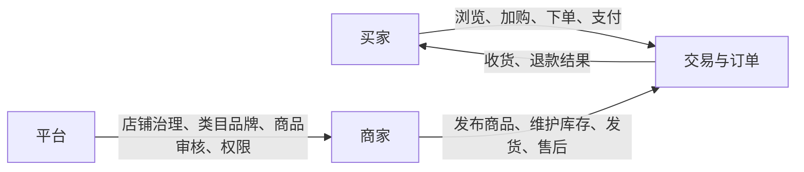

# 时光商城产品调研与业务范围

## 1. 文档目标

本文在现有数据库、Java 实体和技术栈基础上，确定时光商城当前完整版本共同遵循的产品范围。原一期、二期文档保留为两个功能分册，当前交付范围是二者并集；后端实施按领域拆成两条并行开发线，而不是按分册拆分人员。本文回答四个问题：系统服务谁、解决什么流程、当前必须实现什么、哪些常见商城能力暂不实现。

调研日期为 2026-07-26。外部资料只用于验证行业通用流程，现有仓库的 26 表数据模型仍是范围判断的首要约束。

## 2. 现有资产审阅结论

仓库当前已有：

- 26 张 MySQL 业务表及完整字段、索引、外键、`CHECK` 约束和 RBAC 种子数据。
- 用户、店铺、商品、库存、购物车、父交易、子订单、支付、钱包和售后对应的 MyBatis-Plus 实体。
- 商品、订单、支付、钱包和售后状态 Java 枚举。
- Spring Boot 4、Java 21、MyBatis-Plus、Redis、Sa-Token 依赖和环境变量配置。
- 暂无 Controller、Service、Mapper、DTO、统一响应、异常处理和前端工程。

数据库设计已经形成完整领域骨架，并明确：

1. `shop` 是商家数据隔离边界。
2. 一次跨店提交生成一个 `trade_order`，再按店铺拆成多个 `order_info`。
3. 购物车不锁库存，下单才锁；发货才实际扣除锁定库存。
4. 支付只使用用户虚拟钱包，不接入真实支付渠道。
5. 一份售后申请只针对一条订单明细，支持仅退款和退货退款。
6. 平台权限与店铺权限分开，超级管理员也不能绕过店铺成员边界。

## 3. 外部产品调研

### 3.1 参考资料

| 来源 | 观察到的产品结构 | 对本项目的结论 |
| --- | --- | --- |
| [京东购物流程](https://help.jd.com/user/issue/list-29.html) | 购物指南将流程拆为账号注册、挑选商品、查看购物车、填写收货地址和提交订单 | 买家端必须以完整任务链组织，而不是只提供孤立 CRUD |
| [京东售后申请步骤](https://help.jd.com/user/issue/118-4278.html) | 从订单/售后入口选择具体商品，选择售后类型，填写信息并提交，之后查看审核结果 | 售后应以订单明细为入口，并展示申请、审核、退回、退款的状态进度 |
| [京东商家帮助中心](https://helpcenter.jd.com/) | 商家工作台围绕品牌类目、商品、订单、运单、自助工具和规则展开 | 本项目商家端应优先支持商品、库存、订单履约、售后和成员权限 |
| [电商订单拆单规则](https://www.woshipm.com/pd/6157875.html) | 多商户订单通常在用户提交后按履约主体拆分 | 现有“父交易统一支付、按店铺拆子订单”的建模合理，应作为接口主视图 |

京东等成熟平台还包含促销、评价、营销、结算、客服、发票和复杂物流。由于本项目没有对应数据模型，也定位为教学商城，本期不复制这些外围能力。

### 3.2 调研归纳

多商户商城的最小业务闭环由三类角色协同完成：

成熟产品的共同设计原则是：

- 用户看到的是一次提交和一次支付，商家看到的是自己店铺的履约子订单。
- 商品可售不只取决于商品自身，还取决于店铺、SPU、SKU 和库存的组合状态。
- 订单必须保存快照，不能随商品或地址后续修改。
- 正向交易和退款都需要状态机、幂等键、资金流水和库存流水。
- 平台权限与商家权限不能只靠前端菜单隐藏，后端必须执行范围校验。

## 4. 产品定位

时光商城是面向教学、课程设计和中小规模演示环境的 B2B2C 多商户商城。它强调交易正确性、权限隔离、状态可追踪和前后端契约清晰，不追求大型电商平台的营销丰富度。

### 4.1 用户角色

| 角色 | 目标 | 核心任务 |
| --- | --- | --- |
| 游客 | 了解平台商品 | 浏览类目、品牌、商品列表和商品详情 |
| 普通用户 `CUSTOMER` | 完成购买并管理自己的交易 | 注册登录、地址、购物车、下单、钱包充值、支付、订单、收货、售后 |
| 店铺管理员 `SHOP_ADMIN` | 管理本店全部业务 | 商品、库存、订单、售后、成员 |
| 商品运营 `SHOP_PRODUCT_OPERATOR` | 维护本店商品 | SPU/SKU 编辑、提交审核、上下架 |
| 订单客服 `SHOP_ORDER_OPERATOR` | 处理本店履约和售后 | 查单、售后审核与退款重试 |
| 库存人员 `SHOP_INVENTORY_OPERATOR` | 管理本店库存和发货 | 入库、调整、流水、订单发货 |
| 平台店铺管理员 `PLATFORM_SHOP_ADMIN` | 管理入驻店铺状态 | 创建店铺、编辑店铺、启用、暂停、关闭 |
| 平台商品审核员 `PLATFORM_PRODUCT_AUDITOR` | 保证商品内容合规 | 审核、拒绝、禁售、解禁 |
| 超级管理员 `SUPER_ADMIN` | 管理平台权限体系 | 用户状态、角色、权限及授权 |

### 4.2 业务模块

| 模块 | 当前模型 | 必须提供的产品能力 | 功能分册 |
| --- | --- | --- | --- |
| 身份认证 | `sys_user` | 注册、登录、退出、会话、资料、账号状态检查 | 基础交易 |
| 地址 | `user_address` | 增删改查、唯一默认地址 | 基础交易 |
| 平台 RBAC | `sys_role` 等 4 表 | 角色、权限、平台角色分配、用户停用/解锁 | 治理与售后 |
| 店铺 | `shop` | 平台创建和维护店铺、状态治理、公开信息 | 基础交易 |
| 店铺成员 | `shop_user` | 添加成员、改角色、启停成员 | 治理与售后 |
| 类目属性品牌 | `product_category` 等 3 表 | 类目树、叶子属性模板、品牌维护 | 基础交易 |
| 商品 | `product_spu` 等 4 表 | SPU/SKU、属性、审核、上下架、历史、禁售 | 两分册共同覆盖 |
| 库存 | `inventory_stock`、`inventory_transaction` | 查询、入库、下单锁定、取消释放、发货扣减、调整、流水 | 两分册共同覆盖 |
| 购物车 | `cart_item` | 加购、改数量、选择、删除、按店铺展示、失效提示 | 基础交易 |
| 交易订单 | `trade_order` 等 4 表 | 结算预览、跨店提交、取消、统一支付、商家发货、确认收货、历史 | 基础交易 |
| 钱包支付 | `wallet_account` 等 3 表 | 钱包查询、模拟充值、支付尝试、余额扣减、流水 | 基础交易 |
| 售后退款 | `after_sale_request` | 申请、撤销、审核、退货信息、收货、退款、失败重试 | 治理与售后 |
| 自动任务 | 订单/支付/退款现有字段 | 超时取消、自动完成、退款重试、聚合对账 | 治理与售后 |

## 5. 核心业务流程

### 5.1 商品发布到可购买

1. 平台创建并启用店铺，指定首位店铺管理员。
2. 平台维护启用的叶子类目、类目属性模板和品牌。
3. 商家创建 SPU、填写描述属性并创建至少一个 SKU。
4. 商家为 SKU 入库，并提交商品审核。
5. 平台审核通过后商品进入 `OFF_SHELF`。
6. 商家主动上架后进入 `ON_SHELF`；只有满足完整可购买条件的 SKU 才在买家端出现。

### 5.2 跨店购买

1. 买家将多个店铺的 SKU 加入购物车。
2. 结算预览重新读取价格、状态和库存，并按店铺分组。
3. 买家选择地址、填写各店备注并提交。
4. 后端在一个事务中创建父交易、子订单、订单明细、状态历史并锁库存。
5. 买家创建支付尝试并使用钱包支付。
6. 支付成功后父交易为 `PAID`，各子订单独立进入待发货。
7. 各店铺分别发货，买家分别确认收货。

### 5.3 售后退款

1. 买家从具体订单明细发起申请，选择仅退款或退货退款。
2. 系统计算剩余可申请数量和金额，不接受前端自行决定退款上限。
3. 店铺批准、拒绝；拒绝必须填写原因。
4. 仅退款批准后直接进入退款；退货退款批准后等待买家填写退货物流。
5. 店铺确认退货收货时幂等执行退货入库，随后执行钱包退款。
6. 钱包退款、钱包流水、订单累计退款、明细累计退款和售后资金状态在同一事务内更新；退货入库以独立业务唯一键防止退款重试时重复回库。

## 6. 统一业务决策

这些决策用于补足数据库无法单独表达、但前后端独立开发必须明确的行为。

| 主题 | 决策 |
| --- | --- |
| 登录凭证 | 使用 Sa-Token，HTTP Header 名为 `satoken`，不读 Cookie，不使用 JWT |
| 匿名访问 | 商品、类目、品牌和公开店铺信息允许匿名访问；交易及管理接口必须登录 |
| 业务时区 | 所有业务按 `Asia/Shanghai`，API 时间带 `+08:00` 偏移 |
| ID | API 中所有 `BIGINT` 均以十进制字符串传输，防止 JavaScript 精度丢失 |
| 金额 | API 中使用两位小数字符串，例如 `"99.00"`；后端以 `BigDecimal` 计算 |
| 支付期限 | 父交易默认 30 分钟未支付自动取消；配置项 `market.order.pay-timeout-minutes=30` |
| 自动收货 | 发货 7 天后自动完成；配置项 `market.order.auto-complete-days=7` |
| 运费 | 当前无运费模板，当前完整版本统一为 `0.00`；字段保留但前端不得提交运费 |
| 图片 | 当前只接收已上传资源的 HTTPS URL；文件上传和对象存储不在当前范围 |
| 稳定编码 | 类目编码、品牌编码、角色编码及各业务编号创建后不可修改或复用 |
| 商品编号 | `spu_no`、`sku_no` 由后端生成并返回，前端不提交 |
| 订单编号 | `trade_no`、`order_no`、`payment_no`、流水号和售后号均由后端生成 |
| 店铺入驻 | 当前没有资质申请表；由平台管理员直接创建店铺并分配首位管理员 |
| 支付方式 | 仅支持模拟钱包，不展示银行卡、微信、支付宝等入口 |
| 售后时限 | 待发货订单可申请仅退款；待收货可申请两类售后；已完成订单在完成后 7 天内可申请 |
| 物流 | 只记录承运商与运单号，不抓取或展示实时轨迹 |
| 删除 | 有历史引用的数据不物理删除；商品和地址按现有软删除规则处理 |

## 7. 范围外能力

| 能力 | 不纳入原因 |
| --- | --- |
| 优惠券、满减、积分、秒杀 | 无营销活动、优惠分摊和核销模型 |
| 真实支付、回调、退款渠道 | 当前只有钱包和本地事务模型 |
| 商家结算、佣金、提现 | 无结算账户、账期和分账模型 |
| 评价、收藏、足迹、推荐 | 无对应表和搜索/推荐基础设施 |
| 多仓、运费模板、拆包裹 | 当前一 SKU 一库存、一子订单一组物流字段 |
| 换货、维修、平台仲裁 | 售后状态只覆盖仅退款和退货退款 |
| 店铺装修、营销中心、客服聊天 | 超出当前教学交易闭环 |

## 8. 产品成功标准

- 不同店铺人员无法读取或修改其他店铺数据。
- 同一购物车可跨店提交，用户只支付一次，商家只看到自己的子订单。
- 并发下单不超卖，并发支付不重复扣款，并发退款不重复入账。
- 商品、订单、库存、钱包和售后关键变化均可通过历史或流水追溯。
- 前端仅依赖接口契约和 Mock 即可完成页面开发，后端不依赖前端实现即可完成接口和契约测试。
- 两个功能分册的全部验收场景均能使用固定测试数据重复执行。
