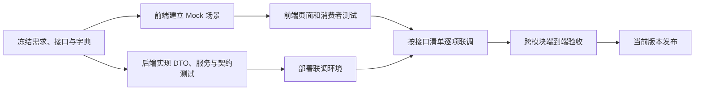

# 时光商城前后端独立开发规范

## 1. 目标

本文保证前端和后端在接口实现尚未完成时可以并行开发，并在联调阶段以契约而不是口头约定判断对错。适用于当前完整版本的两个功能分册；发生冲突时，[统一 API 契约](../api/common-contract.md)和对应接口分册优先。两名后端人员之间的领域拆分、跨线端口和集成顺序见[后端双线并行开发规范](backend-dual-track-development.md)。

独立开发的含义是：

- 前端可只依赖接口文档、固定字典和 Mock 数据完成页面、交互、状态和测试。
- 后端可只依赖产品需求、接口 DTO 和数据库规范完成 Controller、Service、Mapper、事务和测试。
- 测试可在没有完整 UI 时调用 API 验证，也可在没有真实后端时使用 Mock 验证前端。

## 2. 契约基线

### 2.1 当前完整契约文件

1. `docs/product/product-research-and-scope.md`
2. `docs/product/phase-1-requirements.md`
3. `docs/product/phase-2-requirements.md`
4. `docs/api/common-contract.md`
5. `docs/api/dto-catalog.md`
6. `docs/api/phase-1-api.md`
7. `docs/api/phase-2-api.md`
8. `docs/database/phase-1-design.md`
9. `docs/development/backend-dual-track-development.md`
10. `sql/schema.sql`
11. `sql/schema2.sql`

`phase-1`、`phase-2` 文件名仅代表功能分册。上述文件共同构成同一份当前契约，不能只冻结基础交易分册后忽略治理与售后对发货、收货、退款和权限的约束。

### 2.2 数据库迁移前置

- `schema.sql` 是已经发布的不可回写基线，不得为了当前需求直接修改其历史内容。
- `schema2.sql` 是当前完整版本必要增量，不只服务治理与售后；基础交易中的平台目录权限同样依赖它。
- 新空库必须执行 `schema.sql -> schema2.sql`；已执行基线的存量库只执行尚未应用的 `schema2.sql` 及后续迁移。
- 后续变更继续新增编号迁移，不得重新执行或覆盖已经在服务器执行过的脚本。

开发开始前，由前端、后端和测试各指定一名契约负责人，共同确认上述契约文件的 Git 提交号。之后所有缺陷必须先判断是“实现不符合契约”还是“契约需要变更”。

## 3. 职责边界

| 内容 | 产品/设计 | 前端 | 后端 | 测试 |
| --- | --- | --- | --- | --- |
| 业务范围、流程、验收 | 主责 | 评审 | 评审 | 评审 |
| URL、DTO、错误码 | 参与 | 评审 | 主责 | 评审 |
| 页面布局和交互 | 主责 | 主责 | 提供约束 | 评审 |
| 鉴权、数据范围、事务 | 提供目标 | 不作为安全边界 | 主责 | 验证 |
| Mock 数据 | 提供业务场景 | 主责维护 | 评审语义 | 使用并补场景 |
| 数据库和迁移 | 不直接修改 | 不直接依赖表 | 主责 | 验证 |
| 契约测试 | 评审 | 消费者测试 | 提供者测试 | 主责场景 |
| 变更记录 | 主责业务理由 | 评估页面影响 | 评估服务影响 | 评估回归范围 |

前端不得直接依赖数据库字段名或后端实体；后端不得直接将 MyBatis-Plus 实体序列化为 API 响应。双方通过独立 Request/Response DTO 交互。

## 4. 并行开发流程



### 4.1 契约冻结

每个接口进入开发前必须具备：

- 方法、路径和鉴权级别。
- 查询参数或请求体字段、类型、必填性和约束。
- 成功响应字段、类型、空值规则和示例。
- 至少一个业务错误码。
- 若为状态动作，明确允许的源状态和目标状态。
- 若为幂等动作，明确是否需要 `Idempotency-Key`。
- 若为分页，明确排序白名单和默认排序。

上述任一项缺失时，该接口不能标记为“契约就绪”。

### 4.2 前端并行开发

前端按文档建立类型和 API Client，Mock 层只替换网络适配器，不在页面组件中写 `if (mock)` 分支。页面开发至少覆盖：

- 正常成功。
- 首次加载和分页加载。
- 空列表或无搜索结果。
- 字段校验错误。
- 未登录、无权限、店铺越权。
- 资源不存在。
- 状态冲突和版本冲突。
- 网络超时和 500。
- 幂等写请求超时后的安全重试。

前端不能根据中文 `message` 判断业务，必须根据 `code`。ID 保持字符串，金额使用字符串或十进制库展示和计算，不使用原生浮点加总。

### 4.3 后端并行开发

后端按领域包组织，例如 `order/controller`、`order/service`、`order/dto`、`order/mapper`。两名后端分别按[后端双线并行开发规范](backend-dual-track-development.md)领取 A/B 线，跨线能力只通过冻结端口。每条线建议顺序：

1. 定义 Request/Response DTO 和 Bean Validation。
2. 定义业务错误码和全局异常映射。
3. 写 Controller 契约测试，先固定 JSON 形状。
4. 写 Service 单元测试，覆盖状态机、金额和权限范围。
5. 实现 Mapper 和事务。
6. 使用 MySQL/Redis 集成测试验证外键、唯一键、锁和幂等。
7. 生成或维护与 Markdown 一致的 OpenAPI 描述，供前端自动检查。

后端 Controller 不包含金额计算、状态迁移或权限范围 SQL；这些逻辑进入 Service 和数据访问层。构造器注入，依赖字段 `private final`。

## 5. Mock 规范

### 5.1 Mock 必须与真实协议一致

Mock 返回完整 HTTP 状态、Header 和统一响应体。不能为了页面方便省略 `code`、`requestId`、`timestamp`，也不能把真实接口的字符串 ID 改成数字。

```http
HTTP/1.1 409 Conflict
Content-Type: application/json

{
  "code": "VERSION_CONFLICT",
  "message": "数据已被其他操作修改，请刷新后重试",
  "requestId": "mock-version-conflict-001",
  "timestamp": "2026-07-26T18:30:15.123+08:00"
}
```

### 5.2 场景选择

本地 Mock 可通过请求头 `X-Mock-Scenario` 或开发工具面板选择场景；该 Header 只能由本地 Mock 消费，不得发送到生产后端。

推荐场景名：

| 场景 | 用途 |
| --- | --- |
| `success` | 默认正常数据 |
| `empty` | 空列表 |
| `unauthorized` | 401 未登录/过期 |
| `forbidden` | 403 无权限 |
| `not-found` | 404 |
| `validation-error` | 400 字段错误 |
| `state-conflict` | 409 状态冲突 |
| `version-conflict` | 409 乐观锁冲突 |
| `business-failure` | 422 业务规则失败 |
| `server-error` | 500 |
| `slow` | 2 秒延迟，用于加载和重复点击测试 |

### 5.3 有状态 Mock

购物车、订单、商品审核和售后必须使用有状态 Mock，动作后后续查询应反映状态变化。例如发货后：

- 订单列表从 `PENDING_SHIPMENT` 变为 `PENDING_RECEIPT`。
- 详情出现物流字段和 `SHIP` 历史。
- `availableActions` 从 `SHIP` 变为空或买家侧 `COMPLETE`。

仅返回一次动作成功但不更新查询数据的 Mock 不足以支持独立页面开发。

## 6. 固定测试数据

所有环境使用相同业务语义的测试账号，实际密码通过开发环境安全渠道配置，不写进仓库。建议账号：

| 用户名 | 平台角色 | 店铺关系 | 用途 |
| --- | --- | --- | --- |
| `buyer_a` | `CUSTOMER` | 无 | 普通购买和售后 |
| `buyer_b` | `CUSTOMER` | 无 | 资源越权测试 |
| `platform_shop_admin` | `PLATFORM_SHOP_ADMIN` | 无 | 店铺管理和平台售后申诉裁决 |
| `platform_auditor` | `PLATFORM_PRODUCT_AUDITOR` | 无 | 目录和商品审核 |
| `super_admin` | `SUPER_ADMIN` | 无 | RBAC 和全局管理 |
| `shop_a_admin` | `CUSTOMER` | A 店 `SHOP_ADMIN` | A 店全部业务 |
| `shop_a_product` | `CUSTOMER` | A 店商品运营 | 商品权限测试 |
| `shop_a_order` | `CUSTOMER` | A 店订单客服 | 订单、售后测试 |
| `shop_a_inventory` | `CUSTOMER` | A 店库存人员 | 库存、发货测试 |
| `shop_b_admin` | `CUSTOMER` | B 店 `SHOP_ADMIN` | 跨店隔离测试 |

基础交易固定业务数据：

| 数据 | 状态 | 用途 |
| --- | --- | --- |
| A 店和 B 店 | `ACTIVE` | 跨店交易 |
| C 店 | `SUSPENDED` | 店铺不可购买 |
| A 商品 1 | `ON_SHELF`，两个有库存 SKU | 正常商品/规格选择 |
| A 商品 2 | `OFF_SHELF` | 购物车失效 |
| B 商品 1 | `ON_SHELF`，有库存 | 跨店拆单 |
| 待审商品 | `PENDING_REVIEW` | 平台审核 |
| 买家 A 钱包 | 可覆盖一次成功交易 | 支付成功 |

治理与售后场景增加：待发货订单、待收货订单、已完成 7 天内订单、部分已退款明细、`PENDING` 售后、`WAITING_RETURN` 售后、`REFUNDING/FAILED` 售后。

测试数据 ID 在环境之间可以不同，测试应通过业务编号或种子别名获取，不能硬编码数据库自增 ID。

## 7. 前端实现契约

### 7.1 API Client

统一网络层负责：

- 注入 `satoken`、`X-Request-Id`。
- 为指定动作生成并缓存 `Idempotency-Key`。
- 解析统一响应并保留原 HTTP 状态。
- 401 清理会话；403 展示权限页；409 交给业务页面处理；500 提供重试。
- 请求和响应日志在开发环境脱敏 Token、手机号、地址和密码。

### 7.2 类型和展示

- API ID 类型统一为 `string`。
- 金额类型统一为 `string`，展示格式化函数只做十进制处理。
- 枚举定义由固定代码导出；展示文案放在单独映射表。
- 时间解析保留偏移，展示按 `Asia/Shanghai`。
- `null` 和字段缺失分开处理，尤其是 PATCH 表单。

### 7.3 操作防重

按钮禁用只是交互保护，网络超时后用户重试必须沿用同一幂等键。收到明确业务成功、明确 4xx 失败或用户修改请求内容后，才释放该键。页面刷新后仍在等待结果的下单/支付，应先查询交易或支付状态，不直接生成新请求。

### 7.4 状态动作

按钮显示同时参考 `availableActions` 和本地权限映射；点击后仍准备处理 `STATE_CONFLICT`。前端不自行把状态改成目标状态，应使用接口响应替换本地资源。

## 8. 后端实现契约

### 8.1 分层

| 层 | 职责 | 禁止事项 |
| --- | --- | --- |
| Controller | HTTP 映射、DTO 校验、调用 Service | 直接查表、写事务、返回实体 |
| Application/Service | 用例编排、权限、状态机、事务、幂等 | 依赖前端传金额快照或状态 |
| Domain helper | 金额分摊、规格规范化、状态迁移规则 | 访问 Web 上下文 |
| Mapper | 参数化 SQL、带店铺范围查询、行锁/条件更新 | 无范围的店铺资源裸查询 |
| Infrastructure | Sa-Token、Redis 幂等、时钟、编号生成 | 泄露框架异常到 API |

### 8.2 DTO 与实体

- Request DTO 使用 Bean Validation；跨字段规则在类级校验或 Service 中完成。
- Response DTO 明确构造，不返回 `passwordHash`、生成列内部细节或数据库乐观锁之外的字段。
- `Long` ID 序列化为字符串，可使用全局 Jackson 配置或 DTO `String`，但必须有契约测试。
- `BigDecimal` 序列化为两位字符串，不能因 `stripTrailingZeros` 返回 `"99"`。
- JSON 列在进入实体前校验类型、长度、唯一性和 URL 安全。

### 8.3 鉴权

- 注册 Sa-Token 拦截器，公开路径白名单精确到商品、类目、品牌和登录注册。
- `StpInterface` 加载平台角色/权限；店铺权限必须结合 `shopId` 做额外服务校验，不能把所有店铺权限简单合并后全局使用。
- 用户、角色、权限、店铺和成员状态变化后清理缓存或使用短 TTL，确保下一请求生效。
- `NotLoginException` 场景映射到统一的 401 错误码。

### 8.4 事务和幂等

- 严格遵守数据库文档锁顺序。
- 先检查 Redis 幂等记录，但最终依赖数据库唯一键和条件更新保护。
- 事务提交成功后再保存最终幂等响应；进程在提交后、写缓存前崩溃时，再次请求通过业务唯一键恢复同一结果。
- 捕获唯一键冲突时必须区分“相同业务已完成”和“真正资源冲突”。

## 9. 测试策略

### 9.1 前端

| 层级 | 覆盖 |
| --- | --- |
| 单元测试 | 金额显示、枚举文案、权限判断、表单校验、API 错误映射 |
| 组件测试 | 加载、空、错误、禁用、分页、弹窗确认、并发冲突 |
| Mock 流程 | 加购到支付、商品审核到上架、发货到收货、售后到退款 |
| E2E | 使用真实联调后端完成两个功能分册的验收场景 |

### 9.2 后端

| 层级 | 覆盖 |
| --- | --- |
| 单元测试 | 状态机、退款上限、运费/金额、规格摘要、权限决策 |
| MVC 契约测试 | HTTP 状态、JSON 字段、ID/金额格式、错误码、鉴权 |
| Mapper 测试 | 店铺范围、软删除、分页、行锁 SQL |
| 集成测试 | MySQL 外键/约束、Redis/Sa-Token、事务回滚、幂等 |
| 并发测试 | 同 SKU 下单、同交易支付/取消、同售后审核/退款 |

如果执行 Python 辅助校验或数据生成脚本，必须使用本机 Conda `data` 环境：`conda run -n data python ...`。

### 9.3 契约测试最小断言

- 所有 ID 是 JSON 字符串。
- 所有金额是两位小数字符串。
- 所有时间包含 `+08:00`。
- 分页形状固定。
- 错误响应不包含 `data`，可包含 `details`。
- 401/403/404/409/422 的错误码与文档匹配。
- 未知请求字段按统一 Jackson 策略拒绝并返回 `BAD_REQUEST`，避免拼写错误被静默忽略。

## 10. 联调环境

建议环境：

| 环境 | 后端 | 数据 | 用途 |
| --- | --- | --- | --- |
| Local Mock | 无 | 前端内存场景 | 前端独立开发 |
| Local API | 本机 Spring Boot | 本机 MySQL/Redis | 后端和单人联调 |
| Integration | 共享部署 | 每日重置固定种子 | 团队联调和 E2E |
| Staging | 类生产配置 | 脱敏验收数据 | 发布验收 |

共享联调环境必须提供：基础 URL、数据库版本、部署提交号、接口文档提交号、数据最近重置时间和已知问题。前端不能直接访问共享数据库修数据；通过种子脚本或受控测试接口重置。

## 11. 联调清单

每个接口按下列顺序联调：

1. 正常请求和响应字段。
2. 必填、边界和非法枚举。
3. 未登录和 Token 过期。
4. 平台权限或店铺权限不足。
5. 资源不存在和其他用户/店铺资源。
6. 状态冲突。
7. 重复请求和并发请求。
8. 分页、筛选和排序。
9. 日志中的 `requestId` 是否可定位。

联调问题记录至少包含：接口、环境、请求 ID、请求摘要、预期、实际、对应契约章节、前端提交号和后端提交号。不要只提交截图或“接口报错”。

## 12. 变更流程

### 12.1 非破坏性变更

新增可选响应字段、增加新的错误详情字段、增加新的可选筛选参数，一般可直接走文档评审。后端先兼容返回，前端按需使用。

### 12.2 破坏性变更

删除/重命名字段、类型变化、必填性变化、枚举语义变化、状态机变化、权限变化、路径变化和金额公式变化必须：

1. 写明业务原因和替代方案。
2. 同步修改产品、API、数据库及测试文档。
3. 前端、后端、测试共同确认迁移窗口。
4. 更新 Mock 和契约测试后再修改实现。
5. 已发布接口需要版本化或兼容期，不得原地破坏。

### 12.3 冲突裁决

- 实现与冻结文档不同：默认修实现。
- 文档无法满足真实业务：先改文档并评审，再改实现。
- 数据库约束与 API 动作冲突：停止联调，由后端和产品共同修订，不能绕过约束。
- 前端希望增加纯展示字段：优先在响应 DTO 中新增派生字段，不反向污染数据库。

## 13. 当前版本完成定义

前后端可以声明当前版本独立开发完成，必须同时满足：

- 文档中的全部接口有前端 API Client 和后端 Controller 对应。
- 前端在 Mock 下通过完整业务流程，且错误场景可演示。
- 后端在无前端条件下通过契约、集成和并发测试。
- 共享环境逐接口联调完成，无未确认的字段或状态语义。
- 两个产品分册的验收场景均通过真实 API 的端到端测试。
- 没有通过临时硬编码、直接改库或关闭约束来完成演示。
