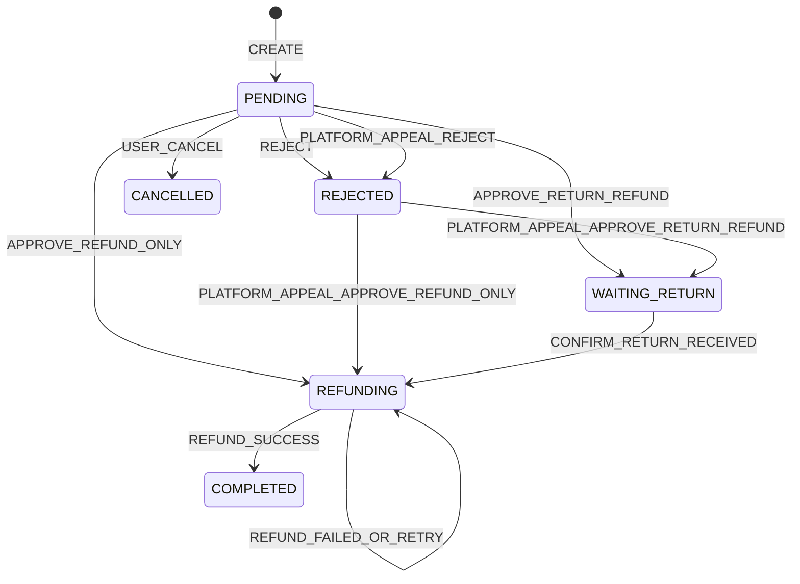

# 时光商城治理与售后功能分册（原二期）

## 1. 分册目标

本分册在基础交易闭环上补齐当前 26 表数据模型支持的权限治理、运营审计、售后退款和自动任务。它与[基础交易功能分册](phase-1-requirements.md)合并组成当前完整版本，不再作为必须晚于基础交易独立部署的“二期版本”。完成后，系统能够演示从平台治理、店铺分工、正常交易到逆向退款的完整生命周期，并具备必要的幂等、对账和故障恢复能力。

文件名中的 `phase-2` 仅为历史稳定名称。本分册不是营销扩展，不增加优惠、评价、真实支付、结算、推荐等新领域。售后申诉和商家通知是本期售后闭环的补充；对应表结构放在 `sql/scheme3.sql` 中，执行该脚本不会使三期商家钱包接口自动上线。

## 2. 治理与售后范围

### 2.1 平台身份与 RBAC

| 功能点 | 详细要求 | 验收标准 |
| --- | --- | --- |
| 用户管理 | 按用户名、手机号、邮箱、状态查询；查看基本资料和平台角色 | 不返回密码摘要；软删除用户不能恢复成新账号 |
| 用户状态 | `ACTIVE`、`DISABLED`、`LOCKED` 之间的管理动作 | 变更后现有 Token 立即失效；必须记录操作者和原因日志 |
| 角色管理 | 查询角色、创建自定义平台/店铺角色、编辑名称说明和状态 | `roleCode` 与 `scopeType` 创建后不可修改 |
| 权限管理 | 查看权限字典、按作用域筛选 | 种子权限不可通过接口删除；权限代码稳定 |
| 角色授权 | 给角色配置同作用域权限 | 平台角色不能配置店铺权限，反之亦然 |
| 平台角色分配 | 给用户添加或移除平台角色 | `sys_user_role` 只接受 `PLATFORM` 角色 |

现有种子角色继续保留；当前范围允许创建细分角色，但角色权限模型仍是静态权限代码，不做字段级、行表达式或临时授权。

### 2.2 店铺成员

| 功能点 | 详细要求 | 验收标准 |
| --- | --- | --- |
| 成员列表 | 按姓名、用户名、角色、状态查询本店成员 | 只返回本店成员，不泄露其他店铺关系 |
| 添加成员 | 使用已存在账号的精确用户名添加，选择 `SHOP` 角色 | 同一用户同店只能一条记录 |
| 修改角色 | 店铺管理员调整成员当前角色 | 不能使用平台角色；立即影响下次鉴权 |
| 启停成员 | `ACTIVE`/`DISABLED` | 停用后现有 Token 仍可登录其他身份，但不能访问该店 |
| 管理员保护 | 保证每个未关闭店铺至少一个有效 `SHOP_ADMIN` | 不能停用或降级最后一名有效管理员 |

### 2.3 商品治理完善

| 功能点 | 详细要求 | 验收标准 |
| --- | --- | --- |
| 平台禁售 | 对 `OFF_SHELF` 或 `ON_SHELF` 商品执行 `BAN` | 必须填写原因，商品立即从公开端消失 |
| 平台解禁 | `BANNED -> OFF_SHELF` | 解禁不自动上架，由商家重新确认 |
| 平台强制下架 | `ON_SHELF -> OFF_SHELF` | 必须填写原因，历史操作者为平台 |
| 商品历史 | 商家和平台按权限查看不可变状态历史 | 历史与当前版本、状态能对应 |

### 2.4 库存审计

| 功能点 | 详细要求 | 验收标准 |
| --- | --- | --- |
| 库存流水 | 按 SKU、类型、业务编号、时间分页查询 | 变化前数量可由流水准确推导 |
| 人工调整 | 对可用和锁定库存做有审计的修正 | 必须填写原因；结果不能为负；写 `ADJUST` 流水 |
| 业务追踪 | 从订单、售后跳转关联库存流水 | `businessType + businessNo` 可定位来源 |

人工调整是异常修复能力，不是普通入库替代。调整锁定库存前必须确认不会破坏仍处于 `LOCKED` 的订单明细总量；后端执行校验，前端不能强制绕过。

### 2.5 售后与退款

#### 买家能力

| 功能点 | 详细要求 | 验收标准 |
| --- | --- | --- |
| 可申请额度 | 从订单明细查询剩余可申请数量、金额和支持类型 | 金额由服务端计算，不信任前端 |
| 创建申请 | 选择单条明细、类型、数量、原因、说明、凭证 URL | 重复提交幂等；累计不超购买/实付 |
| 售后列表/详情 | 按状态和订单查询，显示完整进度 | 只能查看本人申请 |
| 撤销申请 | 只允许 `PENDING` | 撤销后不可恢复 |
| 退货物流 | 已批准的退货退款填写承运商和运单号 | 首次提交只允许一次；商家确认收货前可带 `version` 更正，确认收货后不可修改 |

#### 商家能力

| 功能点 | 详细要求 | 验收标准 |
| --- | --- | --- |
| 售后列表/详情 | 按状态、类型、订单号、时间查询本店申请 | 能查看订单快照、申请证据和可批额度 |
| 批准 | 可批准不超过申请的数量和金额 | 仅退款进入退款，退货退款进入待退货 |
| 拒绝 | 必须填写拒绝原因 | 状态为 `REJECTED`，批准字段保持空 |
| 确认退货收货 | 校验完整退货物流后确认 | 确认后进入退款处理并退货入库 |
| 退款重试 | 对 `refundStatus=FAILED` 的申请重试 | 沿用同一 `refundNo`，不重复退款 |

#### 申诉与平台介入

商家审核不是售后的最终救济渠道。买家在商家拒绝申请后可以立即申诉；商家在申请提交后 48 个自然小时内没有批准或拒绝时，买家也可以发起超时申诉。申诉只针对一份具体的 `after_sale_request`，同一售后单最多提交一次申诉，申诉提交后原售后单冻结商家审核动作，避免商家与平台同时裁决。

| 功能点 | 详细要求 | 验收标准 |
| --- | --- | --- |
| 申诉资格 | 支持 `REJECTED` 售后立即申诉，支持 `PENDING` 且已超过 48 小时未处理的售后申诉 | 未达到条件、已存在申诉或售后已完成/撤销时拒绝 |
| 提交申诉 | 买家填写申诉原因、补充说明和凭证 | 服务端校验本人、售后归属、版本和申诉唯一性；必须幂等 |
| 平台待处理 | 平台管理员查看跨店申诉列表和详情 | 能看到原申请、商家审核记录、买家申诉证据、订单和商品快照 |
| 平台裁决 | 平台管理员批准或驳回申诉；批准时确认数量和金额 | 只能按原申请类型处理，金额和数量不能超过服务端重新计算的可退上限 |
| 裁决联动 | 批准退货退款进入 `WAITING_RETURN`；批准仅退款进入 `REFUNDING` 并执行退款；驳回保持/变为 `REJECTED` | 裁决和原售后状态、审核信息、退款任务在同一事务中保持一致 |
| 商家通知 | 申诉提交、平台裁决都通知对应店铺的有效售后成员 | 商家可在通知列表中看到申诉号、售后号、裁决结果和处理原因；同一事件不重复通知 |
| 通知已读 | 商家只能标记自己的通知为已读 | 不得读取或修改其他店铺、其他成员的通知 |

平台裁决不等于平台直接修改钱包。若裁决触发退款，必须复用既有退款服务和幂等 `refundNo`；三期商家钱包启用后，再在同一退款事务中追加商家结算扣款。平台只读运营权限不能执行裁决。

#### 售后申请资格

| 子订单状态 | `REFUND_ONLY` | `RETURN_REFUND` | 说明 |
| --- | --- | --- | --- |
| `PENDING_PAYMENT` | 否 | 否 | 应取消父交易，不创建售后 |
| `PENDING_SHIPMENT` | 是 | 否 | 未发货，仅退款成功后释放库存 |
| `PENDING_RECEIPT` | 是 | 是 | 已发货，仅退款不回库存；退货退款确认收货后回库存 |
| `COMPLETED` | 是 | 是 | `completedAt` 后 7 天内可申请 |
| `CANCELLED` | 否 | 否 | 无已支付履约可售后 |

申请数量和申请金额上限遵循数据库文档的累计退款公式。创建申请和资格查询时，`PENDING` 按申请数量/金额占用，`WAITING_RETURN`、`REFUNDING` 按批准数量/金额占用；`REJECTED` 和 `CANCELLED` 不占用，`COMPLETED` 已计入订单明细累计退款。商家批准时另按数据库文档的批准口径，在锁内扣除其他已批准且未结束申请后复核本次批准量。

### 2.6 平台运营只读查询

平台为排障提供跨店订单、支付、钱包流水、售后和申诉只读查询。平台申诉裁决是单独的受保护动作，不属于只读查询；平台人员不能通过只读权限替商家发货、批准售后或直接修改买家钱包。

若教学范围不需要单独页面，可先通过管理端的全局检索实现；接口仍需严格脱敏买家数据，只在处理交易排障时返回必要地址和电话。

### 2.7 自动任务与对账

| 任务 | 默认频率 | 处理规则 | 幂等保护 |
| --- | --- | --- | --- |
| 未支付超时取消 | 每分钟 | 取消到期父交易、子订单，释放库存 | 交易状态条件 + 库存流水业务唯一键 |
| 自动确认收货 | 每小时 | 发货满 7 天且没有活跃售后的待收货订单完成 | 订单状态条件 + 唯一状态历史语义 |
| 支付单过期 | 每分钟 | 到期 `PENDING -> CANCELLED` | 支付单状态条件 |
| 退款重试 | 每 5 分钟 | 重试 `FAILED` 或超时 `PROCESSING` | 售后锁 + 固定 `refundNo` + 钱包业务唯一键 |
| 库存对账 | 每日 | 流水重算值与聚合值比较 | 只报告，不自动篡改 |
| 钱包对账 | 每日 | 流水末值与余额比较 | 只报告，不自动篡改 |

多实例只允许一个实例处理同一批资源，可以使用 Redis 分布式锁或抢占更新。任务每次处理限制批量大小，失败记录错误并允许下次继续。

活跃售后指 `after_sale_request` 的 `PENDING`、`WAITING_RETURN`、`REFUNDING`，以及关联 `after_sale_appeal.status=PENDING` 的申诉。待发货子订单存在活跃售后时禁止商家发货；待收货子订单存在活跃售后时禁止买家手工确认和系统自动完成；申诉待裁决期间即使原售后为 `REJECTED`，也必须保留订单保护。申诉被驳回、售后被撤销或退款完成后，正向履约动作重新按当前订单状态开放。

## 3. 治理与售后页面

### 3.1 买家端

| 页面 | 必须展示 | 主要操作 |
| --- | --- | --- |
| 订单明细售后入口 | 剩余数量、最大金额、支持类型、售后期限 | 发起申请 |
| 售后申请页 | 订单快照、类型、数量、原因、说明、凭证 URL | 提交 |
| 售后列表 | 售后号、商品、类型、状态、申请/批准金额、更新时间 | 状态筛选、查看 |
| 售后详情 | 申请、审核、退货、退款进度和失败原因 | 撤销、填写退货物流 |

### 3.2 商家端

| 页面 | 必须展示 | 主要操作 |
| --- | --- | --- |
| 成员管理 | 用户、角色、状态、加入时间 | 添加、改角色、启停 |
| 售后工作台 | 售后号、订单、商品、类型、状态、金额、申请时间 | 筛选、审核 |
| 售后详情 | 订单快照、申请额度、凭证、物流、退款 | 批准、拒绝、确认收货、重试 |
| 商家通知 | 未读/已读通知、申诉号、售后号、平台裁决原因 | 查看、标记已读 |
| 库存流水 | SKU、类型、变化、结果、业务号、操作者、时间 | 筛选、跳转来源 |
| 库存调整 | 当前数量、调整后预览、原因 | 提交有版本的调整 |

### 3.3 平台端

| 页面 | 必须展示 | 主要操作 |
| --- | --- | --- |
| 用户管理 | 用户名、联系方式、状态、平台角色、时间 | 状态变更、角色分配 |
| 角色权限 | 作用域、角色、权限矩阵、状态 | 创建角色、编辑、授权 |
| 商品治理 | 商品、店铺、状态、历史、原因 | 强制下架、禁售、解禁 |
| 运营检索 | 交易、订单、支付、售后和流水关联关系 | 只读排障 |
| 售后申诉处理 | 申诉列表、原售后审核、买家证据、订单快照 | 查看申诉、批准或驳回、填写裁决原因 |

## 4. 关键状态与动作

### 4.1 售后状态机

`return shipping submitted` 不改变主状态，仍为 `WAITING_RETURN`。退款执行是服务端动作，前端不能直接提交 `refundStatus`。

申诉状态独立于售后主状态：`PENDING -> APPROVED|REJECTED`。申诉批准或驳回后不可再次修改；平台裁决记录保留在申诉表中，原售后表中的 `reviewer` 字段只表示当前生效的最后裁决人。商家原审核结果通过申诉快照保留，不因平台介入丢失。

### 4.2 仅退款批准

商家批准后，服务端在同一请求中尝试钱包退款：

- 成功：最终直接返回 `COMPLETED/SUCCESS`。
- 可重试的内部错误：提交业务审核结果并返回 `REFUNDING/FAILED`，后续可手动或定时重试。
- 业务校验错误：整个审核事务回滚，仍为 `PENDING`。

### 4.3 退货退款批准

批准后进入 `WAITING_RETURN/NOT_STARTED`。买家提交退货物流后仍为 `WAITING_RETURN`。商家确认收货时写入 `returnReceivedAt`，并以售后号为业务键执行一次 `RETURN` 库存流水；随后启动钱包退款。库存回库与确认收货绑定，退款失败不会回滚已经确认的实物入库，退款重试只重试资金及订单累计退款处理。

### 4.4 全额未发货退款

当某个 `PENDING_SHIPMENT` 子订单全部明细的全部可退金额和数量均退款成功，并且所有库存预占已经释放时，子订单迁移为 `CANCELLED/REFUNDED`，写 `CANCEL` 历史。部分退款保持 `PENDING_SHIPMENT/PARTIALLY_REFUNDED`。

已发货订单即使全部退款，也不回退主订单状态，维持 `PENDING_RECEIPT` 或 `COMPLETED`，资金状态可为 `REFUNDED`。

## 5. 非功能需求

| 类别 | 要求 |
| --- | --- |
| 权限一致性 | RBAC 修改后清理对应账号权限缓存；后端下一请求生效 |
| 审计 | 用户状态、授权、成员、商品治理、库存调整和售后动作记录操作者、目标、原因和结果 |
| 退款一致性 | 确认收货回库、退款成功、未发货释放库存分别按数据库锁顺序在各自事务内保持聚合值与流水一致 |
| 故障恢复 | `FAILED` 退款可安全重复；定时任务中断后从状态继续 |
| 对账 | 发现差异时告警并生成可定位记录，禁止无审计自动修数 |
| 隐私 | 平台运营查询默认脱敏手机号；只有具备排障权限的详情接口返回必要信息 |
| 性能 | 售后、流水和平台检索全部分页；索引条件优先，禁止无界导出 |

## 6. 治理与售后验收场景

1. 平台创建一个只具有商品审核权限的自定义角色，分配用户后该用户不能管理店铺或 RBAC。
2. 店铺管理员添加商品运营和订单客服；两者只能看到各自权限功能，最后一名店铺管理员不能被停用。
3. 平台禁售一个在售商品，买家列表立即不可见，商家不能自行解禁；平台解禁后商品保持下架。
4. 商家对库存做人工调整，调整前后数量和原因可通过流水追踪；试图将结果调为负数失败。
5. 买家对待发货明细申请部分仅退款，商家批准后钱包入账、锁定库存释放、累计退款正确。
6. 买家对已发货明细申请退货退款，提交物流；商家确认收货后库存回库并退款成功。
7. 商家拒绝售后后，买家立即提交申诉；平台批准后，商家收到通知，退货退款进入 `WAITING_RETURN`。
8. 商家 48 小时未处理售后，买家可以提交超时申诉；平台驳回后售后为 `REJECTED`，商家收到驳回通知。
9. 相同售后/申诉幂等键并发提交三次只产生一条记录；相同退款重试只产生一条钱包流水。
10. 退款执行被模拟为失败后状态为 `REFUNDING/FAILED`，手动重试成功并沿用原 `refundNo`。
11. 超时未支付交易被任务取消并释放库存；任务重复执行不产生额外流水。
12. 人工篡改测试库聚合余额后，对账任务能报告钱包差异但不会自动修改余额。

## 7. 本分册完成定义

- [治理与售后接口分册](../api/phase-2-api.md) 所有接口实现并通过权限、契约和集成测试。
- 售后状态机、退款金额上限、库存变化和钱包流水覆盖单元与并发测试。
- 申诉资格、平台裁决、商家通知去重和裁决触发退款覆盖单元、权限和并发测试。
- 自动任务在单实例和双实例测试中均不重复处理。
- 基础交易回归测试全部通过；本分册只增加已明确记录的兼容性保护和错误码，不得静默改变基础交易接口语义。
- 产品、接口、数据库、Java 枚举和种子权限保持一致。
